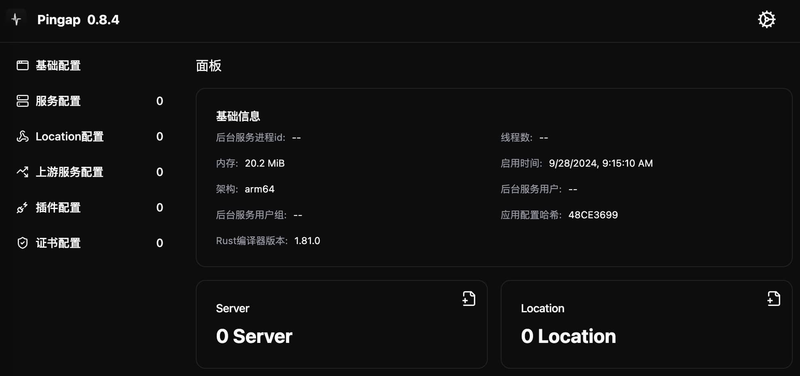
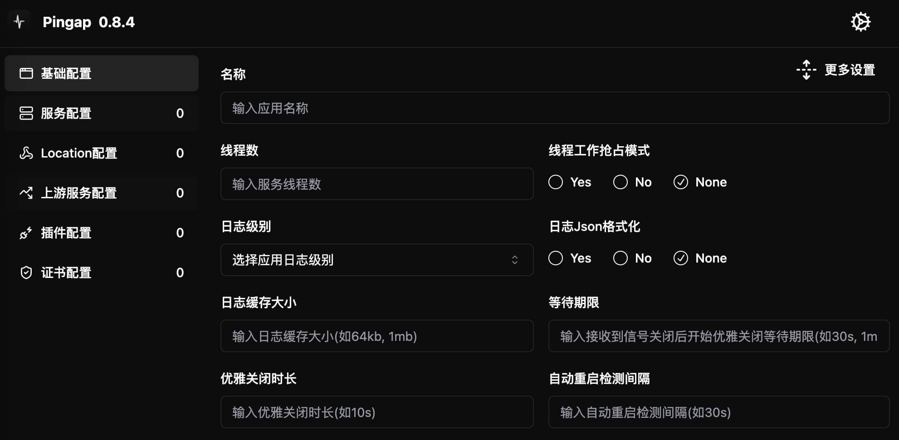
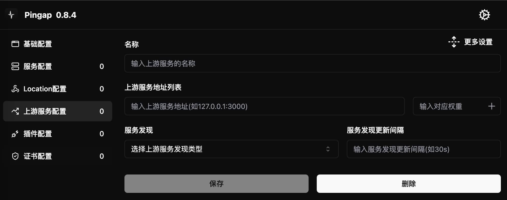
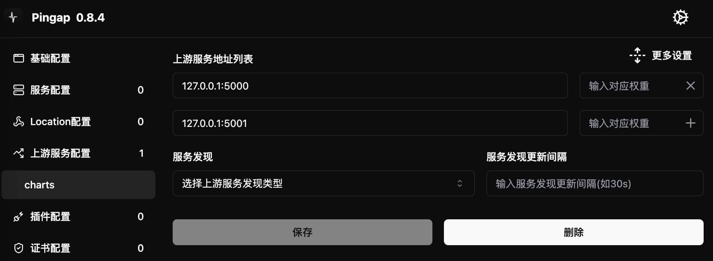
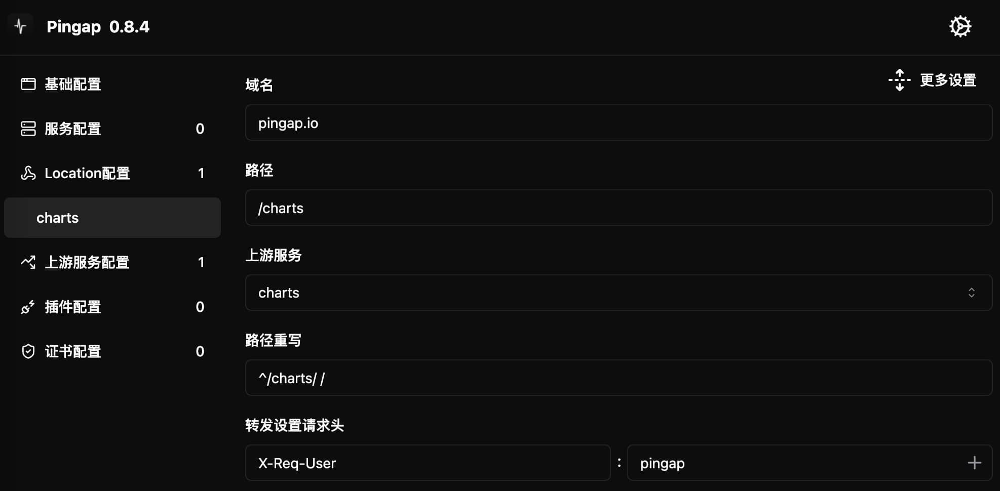
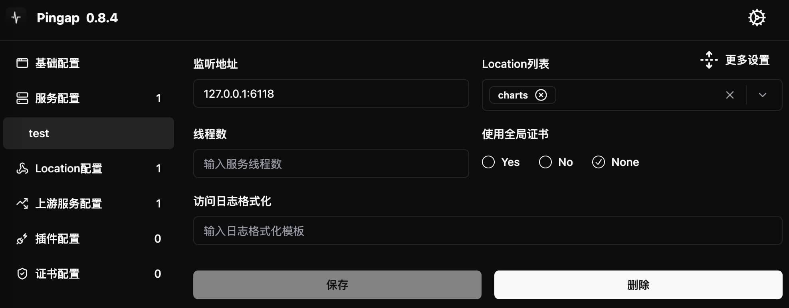

# Getting Started

This section explains how to create a reverse proxy service from scratch. To use the upgrade feature for configuration updates, pingap needs to run as a background process.

For configuration updates, pingap provides two modes:

1. **Hot Reload Mode** (`--autoreload`):
   - Suitable for updating upstream, location, certificate and plugin configurations
   - Changes take effect without restart
   - Recommended for scenarios that only need hot reload support

2. **Restart Update Mode** (`--autorestart`):
   - Suitable for updating server and other basic configurations
   - Requires service restart to take effect
   - Recommended for scenarios requiring frequent basic configuration changes

## Choose Configuration Storage Directory

Pingap supports both file and etcd storage methods for configuration. The only difference is in the startup parameters. This example uses the simpler file storage method.

When using file storage, pingap provides two modes:

1. Directory Mode (Recommended):
   - Specify a directory as the configuration path
   - Automatically generates multiple toml configuration files by category
   - Web management interface uses this mode by default

2. Single File Mode:
   - Specify a file as the configuration path
   - All configurations are saved in one file

Startup example:
```bash
RUST_LOG=INFO pingap -c /opt/pingap/conf
```

After startup, pingap will automatically load all toml configuration files from the specified directory. Since the directory is empty in this example, there won't be any actual effect yet.

## Enable Web Management Backend

For toml configuration details, please refer to the [Application Configuration Guide](/pingap-en/docs/config). It's recommended to use the Web management backend for configuration, which supports the following authentication methods:

1. Basic Auth authentication (optional)
2. Base64 encoded authentication string

### Basic Usage

```bash
# Using username and password
RUST_LOG=INFO pingap -c /opt/pingap/conf --admin=pingap:123123@127.0.0.1:3018

# Using Base64 encoding (base64("pingap:123123"))
RUST_LOG=INFO pingap -c /opt/pingap/conf --admin=cGluZ2FwOjEyMzEyMw==@127.0.0.1:3018

# Reuse existing port and specify path prefix
sudo RUST_LOG=INFO pingap -c /opt/pingap/conf --admin=pingap:123123@127.0.0.1:80/pingap
```

Default configuration details:
- Management backend address: `http://127.0.0.1:3018/`
- Default username: pingap
- Default password: 123123
- Security limit: IPs with multiple password failures will be locked for 5 minutes



After successful startup, visit `http://127.0.0.1:3018/` to access the configuration interface. This interface provides complete configuration management functionality, including basic settings, upstream services, routing rules, etc., which we'll cover in detail in subsequent sections.

:::caution Security Note
To prevent brute force attacks, the management backend implements a login protection mechanism: IPs with multiple incorrect password attempts will be temporarily locked for 5 minutes.
:::

## Basic Configuration

Basic configuration usually can keep default values without special adjustment. However, pay attention in these cases:

- When running multiple pingap instances on the same machine:
  - Must set different `process id file` for each instance
  - Must set different `upgrade sock` paths for each instance
  - This prevents configuration conflicts between multiple instances

:::tip Best Practice
It's not recommended to run multiple pingap instances on the same machine. If you need to support multiple service ports, consider configuring different servers instead.
:::



## Upstream Service Configuration

Due to configuration dependencies, we need to configure upstream services first. Click the "Add Upstream Service" button in the management interface to configure:



### Basic Configuration
- Address format is `ip:port`
- Uses HTTP protocol by default
- If `sni` is configured, automatically uses HTTPS protocol to access upstream nodes

### Advanced Configuration
Although most configuration items have default values, it's recommended to expand the advanced configuration panel:



1. **Timeout Settings**
   - Recommended to set various timeout values based on actual needs
   - Not recommended to use default no-timeout settings

2. **HTTPS Related**
   - `sni`: Server Name Indication for HTTPS connections
   - `verify certificate`: Controls HTTPS certificate verification
   - These settings can be ignored if using HTTP protocol

3. **Health Check**
   - Example: `http://charts/ping`
   - Where `charts` is the Host header for requests
   - Health check directly connects to configured upstream address
   - Note: Domain names are not resolved during checks

## Location Configuration

Location configuration is mainly used to set request routing rules, including domain (host), path, and corresponding upstream services. The configuration interface looks like this:



### Domain (Host) Configuration
- Set according to service domain
- Supports multiple domains: separate with `,`
- Supports regular expressions: start with `~`
- Can be left unset if all services use the same domain

### Path Configuration
- Used to forward different path prefixes to corresponding services
- Supports various matching rules (see location configuration documentation for details)

### Request Header Processing
Supports two processing methods:
1. **Set Forward Headers**
   - Overwrites original header values
   - Suitable for unique headers like `Host`

2. **Add Forward Headers**
   - Preserves original headers
   - Adds new header values

### Route Rewriting
- Configure using regular expressions
- Format: `match_value replacement_value` (separated by space)

:::tip Note
When the upstream service itself is a reverse proxy and matches based on host, you need to set the corresponding `Host` header in the location configuration.
:::

## Server Configuration

Server configuration includes several key parts:

### Listen Address
- Supports configuring multiple service addresses, separated by `,`
- Supports both IPv4 and IPv6
- Example: `127.0.0.1:3001,[::1]:3001` (listening on port 3001 for both IPv4 and IPv6)

### Access Log
- Access logs are generated only when format template is configured
- Provides four preset types:
  - `tiny`
  - `short`
  - `common`
  - `combined`
- Recommendation: Customize log format based on actual needs rather than using presets

### Service Threads
- Default thread count: 1
- Use case: Sufficient for general forwarding services
- Note: Increasing thread count won't bring linear performance improvement



## Background Operation and Auto-Restart

All program configurations are complete, but since the program is loading an older version of the configuration, a restart is needed to load the new configuration. Pingap also supports detecting configuration updates and automatically triggering upgrade operations, launching new instances and closing current ones when updates are detected.

The final adjusted program startup command includes these aspects:

- Program runs as background service
- Program automatically detects configuration updates and restarts if needed. For upstream and location updates, changes are applied in near real-time without restart
- Logs are written to /opt/pingap/pingap.log

```bash
RUST_LOG=INFO pingap -c /opt/pingap/conf \
  -d --log=/opt/pingap/pingap.log \
  --autorestart \
  --admin=pingap:123123@127.0.0.1:3018
```

### Configuration Verification

1. Access Test:
   - Open browser and visit `http://127.0.0.1:6188/charts/`
   - Confirm service is running normally

2. Configuration Update Test:
   - Modify `location` configuration: change path from `/charts` to `/pingap`
   - Modify `rewrite` rules
   - Observe log output:
     ```
     2024-06-30T13:04:28.524079+08:00  INFO reload location success
     ```

### Important Notes

1. **Configuration Update Mechanism**:
   - Configuration check intervals:
     - Regular restart check: 90 seconds
     - Hot reload check: 10 seconds
   - To avoid frequent restarts, configuration updates have about 2 minutes delay

2. **Update Methods**:
   - Hot reload supports:
     - `upstream`, `location`, `certificate`, `plugin` configurations
     - Takes effect without restart
   - Full restart update:
     - Upgrade switching supported only on Linux systems
     - Other configuration changes require restart to take effect
