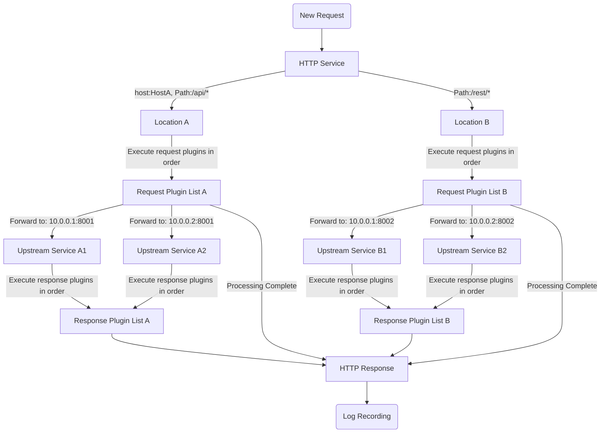

# What is Pingap?

Pingap is a modern, high-performance reverse proxy service built on top of Cloudflare's open-source Rust framework, [Pingora](https://github.com/cloudflare/pingora).

Pingap's core mission is to bring the powerful performance and stability of the [Pingora](https://github.com/cloudflare/pingora) framework to every developer through a simple TOML configuration and a plugin-based architecture, making it easy to master even if you are not familiar with the Rust language.

You can download pre-compiled versions for various system architectures from the [Releases](https://github.com/vicanso/pingap/releases) page at any time.

## Why Choose Pingap?

-   🚀 **Extreme Performance and Reliability**: Inherited from `Pingora`'s asynchronous multi-threaded architecture, it provides network processing capabilities with extremely low latency and high throughput, ensuring your services are stable and efficient.

-   ✍️ **Simple and Intuitive Configuration**: Say goodbye to complex configuration syntax. All configurations can be completed through user-friendly TOML files or an intuitive Web UI. It supports hot-reloading of configurations, enabling zero-downtime changes.

-   🧩 **Highly Flexible Extensibility**: A powerful plugin system spans the entire lifecycle of request processing. Whether it's authentication, rate limiting, caching, or custom logic, you can easily combine them like building blocks to meet various complex scenarios.

## Core Features

#### Powerful Routing and Load Balancing

-   **Fine-grained Routing**: Supports multiple matching modes based on Host and Path (prefix, regex, exact), easily implementing complex routing distribution for a single service.
-   **Flexible Rewriting**: A powerful built-in URL rewriting engine supports regular expressions, making it easy to modify paths or add prefixes.
-   **Intelligent Load Balancing**: Offers multiple load balancing strategies, including round-robin, weighted, and session persistence (based on IP, Header, etc.).

#### Modern Protocols and Security

-   **Comprehensive Protocol Support**: Full support for HTTP/1.x, HTTP/2, and can handle gRPC-web and h2c traffic.
-   **Automated TLS**: Integrated with Let's Encrypt for automatic certificate application and renewal. Supports dynamic certificate selection based on SNI, making it easy to manage multi-domain HTTPS services.

#### Dynamic and Automated

-   **Dynamic Configuration**: Supports loading configurations from the filesystem or etcd. Core configurations (routing, upstreams, etc.) can be hot-reloaded within 10 seconds without a restart.
-   **Service Discovery**: In addition to static address configuration, it supports dynamic service discovery based on DNS and Docker Labels, seamlessly integrating with containerized environments.

#### Observability and Operations

-   **Multi-dimensional Monitoring**: Natively integrated with Prometheus for easy exposure of rich performance metrics, supporting both Pull and Push modes.
-   **Distributed Tracing**: Built-in OpenTelemetry support helps you build complete distributed call chain monitoring.
-   **Highly Customizable Logs**: Provides over 30 template variables, allowing you to customize the access log format as you wish.
-   **Web Admin Interface**: Offers an out-of-the-box Web UI, making configuration management and service status monitoring more intuitive.

## Request Processing Flow

When an HTTP request arrives at Pingap, it goes through a standardized processing flow. You can think of it as an assembly line composed of several processing stations:

1.  **Service Listening**: A Server receives the request on a specified port.
2.  **Route Matching**: Based on the request's Host and Path, the most suitable Location rule is matched.
3.  **Request Processing (Plugins)**: Before the request is forwarded to the upstream service, the request plugins bound to the Location are executed in order (e.g., authentication, rate limiting, request header modification).
4.  **Forward to Upstream**: The request is forwarded to a healthy Upstream backend service according to the load balancing strategy.
5.  **Response Processing (Plugins)**: After receiving the response from the upstream service, the response plugins are executed in order (e.g., compression, caching, modifying response headers).
6.  **Return to Client**: The final processed response is returned to the client.
7.  **Log Recording**: An access log is recorded according to the configured format.

Here is a visualization of the process:

