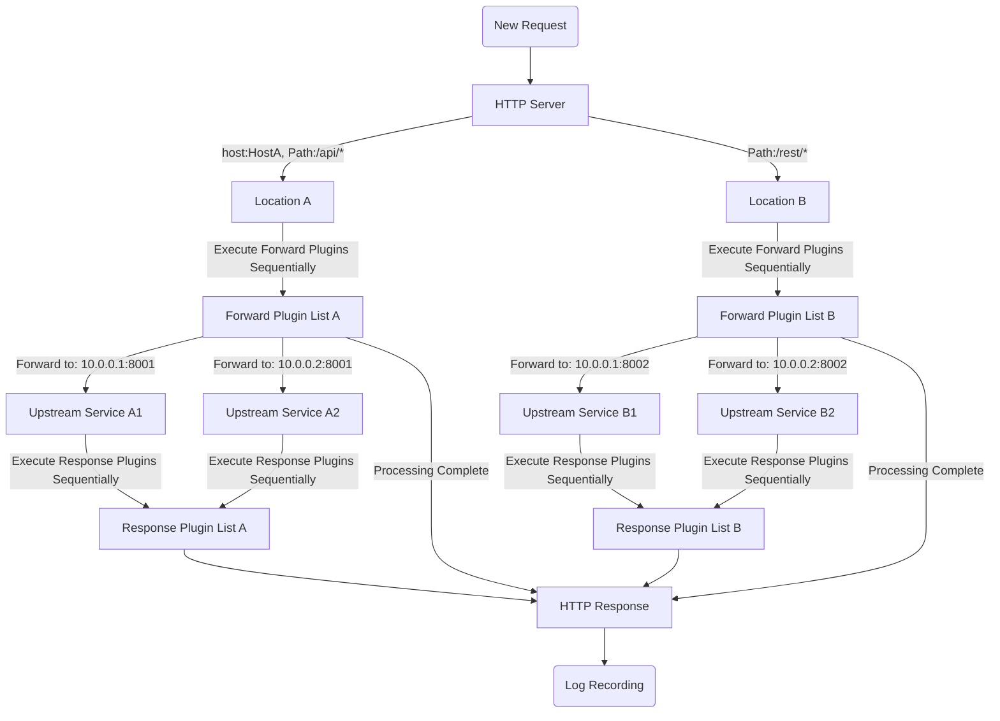

# Pingap Overview

Pingap is a reverse proxy service developed based on [pingora](https://github.com/cloudflare/pingora). While pingora provides rich modules for Rust developers, it's not very friendly for non-Rust developers. Therefore, Pingap offers simple and easy-to-use reverse proxy functionality through TOML configuration files, supporting multiple locations forwarding for a single service and extensibility through plugins. Pre-compiled executables for various architectures can be downloaded from the [releases](https://github.com/vicanso/pingap/releases) page.

Key Features:

- Multiple Location Support: Each service can configure multiple Locations, matched by host and path, with weight-based selection
- Flexible Path Rewriting: Supports regex-based Path rewriting for prefix-based forwarding
- Complete HTTP Support:
  - HTTP/HTTPS transparent proxy
  - Full HTTP 1.0/1.1/2.0 support (including h2c)
  - grpc-web reverse proxy
- Diverse Service Discovery: Supports static configuration, DNS, and docker label methods
- Simple Configuration: Based on TOML format, can be stored in files or etcd
- Rich Monitoring Metrics:
  - Built-in 10+ Prometheus metrics
  - Supports both pull and push collection methods
  - OpenTelemetry support (w3c context trace and jaeger trace)
- Dynamic Configuration Updates:
  - Upstream, Location, and Plugin configurations take effect within 10 seconds, without request interruption
  - Other configuration updates through graceful restart, ensuring service continuity
- Customizable Access Logs: Supports template configuration with 30+ attributes
- Convenient Management Interface: Provides Web admin panel with simple and intuitive operations
- Comprehensive TLS Support:
  - Out-of-the-box Let's Encrypt certificates
  - Support for multi-domain certificates
  - Single-port multi-domain certificates with automatic SNI matching
- Event Notification Mechanism: Supports event pushing for `lets_encrypt`, `backend_status`, `diff_config`, `restart`, etc.
- Rich Plugin Ecosystem: Provides various functional components including caching, compression, authentication, rate limiting, etc.

## Processing Flow

Pingap's core functionality mainly handles the following logic (richer features are implemented through various plugins):

- Selects corresponding location based on path and host, with path supporting prefix, regex, and exact matching
- Location rewrites path according to configuration and adds corresponding request headers
- Executes corresponding forward middleware
- Executes corresponding response middleware
- Outputs access logs according to configured log format

## Plugin System

Pingap's plugins are mainly divided into two categories: pre-request and post-response processing, providing compression, caching, authentication, flow control, and various other application requirements. Plugins are added to locations, and different plugins can be configured according to different needs, then added to locations to achieve different feature combinations. Note that plugins are executed in order, adjust their sequence as needed.

[Plugin System](/pingap-en/docs/plugin)

## Access Log Formatting

Logs are now configured per server, so all locations under that server share the configuration. Various placeholders are supported, configure different access log outputs as needed.

[Detailed Log Formatting Documentation](/pingap-en/docs/log)

## Application Configuration

[Detailed Application Configuration Documentation](/pingap-en/docs/config)
