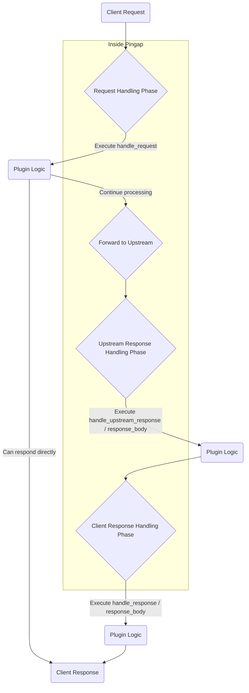

# Plugin System

Plugins are the core extension mechanism of `Pingap`. By attaching a series of plugins to a `Location`, you can implement a wide range of complex functionalities such as authentication, rate limiting, caching, content modification, and observability, flexibly customizing the request and response processing flow.

## Core Concept: The Request Processing Lifecycle

To understand how plugins work, you first need to understand the complete lifecycle of a request within `Pingap`. The new plugin system allows you to attach logic at several key nodes (Hooks) in the lifecycle.

Below is a simplified flowchart of the request processing:



As shown in the diagram, plugins can primarily operate within three major phases, each of which is further divided into handling the Header and the Body.

### Plugin Execution Points and Methods

A plugin can implement multiple methods from the `Plugin` trait to execute specific logic at different nodes of the lifecycle.

#### 1. Request Handling Phase (`handle_request`)

This is the first point at which a plugin can intervene, before `Pingap` routes the request and forwards it to the upstream service.

-   **When is it called?**: At the very beginning of request processing.

-   **Primary Uses?**:
    -   **Access Control**: Such as IP blacklists/whitelists, API key authentication, JWT validation.
    -   **Request Modification**: Adding, removing, or modifying request headers.
    -   **Traffic Control**: Request rate limiting.
    -   **Short-circuiting Requests**: Directly returning a response without accessing the backend (e.g., returning mock data, a maintenance page, or a redirect).

-   **Key Return Value (`RequestPluginResult`)**:
    -   `Continue`: The request, after being processed or modified by the plugin, continues to the next step in the flow.
    -   `Respond`: Interrupts the current request and immediately sends a response generated by the plugin back to the client.

#### 2. Upstream Response Handling Phase (`handle_upstream_response` / `handle_upstream_response_body`)

After Pingap receives a response from the backend Upstream, plugins can intervene in this phase before it is cached or otherwise processed.

-   **When is it called?**: Immediately after receiving the upstream response, but before it is written to any cache.

-   **Primary Uses?**:
    -   **Inspecting Original Response**: Logging or analyzing the "rawest" response headers and body from the backend.
    -   **Early Response Modification**: Modifying the response header or body before it is used by other modules (like the cache).

-   **Related Methods**:
    -   `handle_upstream_response`: Handles the upstream response's Header.
    -   `handle_upstream_response_body`: Processes the upstream response's Body chunks in a streaming fashion.

#### 3. Client Response Handling Phase (`handle_response` / `handle_response_body`)

This is the final point at which a plugin can intervene, before Pingap prepares to send the final response to the client.

-   **When is it called?**: After all internal processing is complete (including fetching a response from the cache), but before it is sent to the client.

-   **Primary Uses?**:
    -   **Final Content Modification**: Injecting analytics scripts into HTML pages, uniformly modifying the structure of JSON responses, performing find-and-replace on the response body.
    -   **Adding Common Response Headers**: Adding custom response headers like `Server-Timing` or `X-Trace-Id` to all responses.
    -   **Response Compression/Decompression**: Implementing custom compression logic.

-   **Related Methods and Return Values**:
    -   `handle_response`: Handles the final response's Header.
    -   `handle_response_body`: Processes the final response's Body in a streaming fashion.
    -   **Key Return Value (`ResponseBodyPluginResult`)**:
        -   `PartialReplaced`: Replaces the currently received Body data chunk.
        -   `FullyReplaced`: Replaces the entire response body with a completely new one.

### The `Plugin` Trait Explained

Below is the definition of the `Plugin` trait that developers need to implement when creating custom plugins. It clearly shows all the available lifecycle hooks.

```rust
/// Core trait that defines the interface all plugins must implement.
#[async_trait]
pub trait Plugin: Sync + Send {
    /// Returns a unique key that identifies this specific plugin instance.
    fn config_key(&self) -> Cow<'_, str> {
        Cow::Borrowed("")
    }

    /// Processes an HTTP request at a specified lifecycle step.
    #[inline]
    async fn handle_request(
        &self,
        _step: PluginStep,
        _session: &mut Session,
        _ctx: &mut Ctx,
    ) -> pingora::Result<RequestPluginResult> {
        Ok(RequestPluginResult::Skipped)
    }
    
    /// Processes an upstream response header at a specified lifecycle step.
    #[inline]
    fn handle_upstream_response(
        &self,
        _session: &mut Session,
        _ctx: &mut Ctx,
        _upstream_response: &mut ResponseHeader,
    ) -> pingora::Result<ResponsePluginResult> {
        Ok(ResponsePluginResult::Unchanged)
    }

    /// Processes an upstream response body chunk at a specified lifecycle step.
    #[inline]
    fn handle_upstream_response_body(
        &self,
        _session: &mut Session,
        _ctx: &mut Ctx,
        _body: &mut Option<bytes::Bytes>,
        _end_of_stream: bool,
    ) -> pingora::Result<ResponseBodyPluginResult> {
        Ok(ResponseBodyPluginResult::Unchanged)
    }

    /// Processes the final HTTP response header before sending to the client.
    #[inline]
    async fn handle_response(
        &self,
        _session: &mut Session,
        _ctx: &mut Ctx,
        _upstream_response: &mut ResponseHeader,
    ) -> pingora::Result<ResponsePluginResult> {
        Ok(ResponsePluginResult::Unchanged)
    }

    /// Processes the final HTTP response body chunk before sending to the client.
    #[inline]
    fn handle_response_body(
        &self,
        _session: &mut Session,
        _ctx: &mut Ctx,
        _body: &mut Option<bytes::Bytes>,
        _end_of_stream: bool,
    ) -> pingora::TResult<ResponseBodyPluginResult> {
        Ok(ResponseBodyPluginResult::Unchanged)
    }
}
```

