# Plugin System

The plugin system allows you to extend Location's functionality by adding various plugins, supporting scenarios like authentication, flow control, response header settings, etc. Through plugins, you can flexibly customize the request handling process.

## Plugin Execution Points

Plugins can execute at different stages of request processing, currently supporting three timing points:

- `Request`: At the very beginning of the request
  - Suitable for early interception scenarios like permission verification
  
- `ProxyUpstream`: Before forwarding to upstream nodes
  - Executes after reading from cache
  - Suitable for scenarios that need to limit upstream access but allow cache access
  - Example: Limiting request rate to upstream while allowing high concurrency cache reads

- `Response`: After upstream response
  - Used for processing and modifying response data from upstream

```rust
#[async_trait]
pub trait Plugin: Sync + Send {
    // Returns plugin type for categorization
    fn category(&self) -> PluginCategory;
    
    // Specifies plugin execution timing (Request/ProxyUpstream/Response)
    fn step(&self) -> String;
    
    // Request handling hook function
    // Returns Some(response) to complete request and return response directly
    // Returns None to continue subsequent processing
    async fn handle_request(...) -> Result<Option<HttpResponse>>;
    
    // Response handling hook function
    // Returns Some(bytes) to rewrite response body
    // Returns None to use original response
    async fn handle_response(...) -> Result<Option<Bytes>>;
}
```

There are three main implementations:

- `category`: Plugin type, used to distinguish what form of plugin it is
- `step`: Plugin execution timing, choose timing based on needs, different plugins have different choices
- `handle_request`: Plugin's pre-forwarding execution logic. If returns `Ok(Some(HttpResponse))`, indicates request is complete, won't forward to upstream, and will transmit response to client
- `handle_response`: Plugin's pre-response execution logic. If returns `Ok(Some(Bytes))`, indicates response data should be rewritten

## Stats Performance Monitoring Plugin

The Stats plugin exposes application performance metrics for third-party system monitoring. It can be used in two ways:

1. Using the built-in `pingap:stats` plugin
2. Custom configuring a new Stats plugin

### Configuration Example

```toml
[plugins.stats]
category = "stats"
path = "/stats"  # Access path
remark = "Performance metrics collection"
```

### Configuration Parameters

- `path`: Metrics data access path, if configured as `/stats` then metrics can be accessed via this path
- `step`: Plugin execution timing, can be either `request` or `proxy_upstream`

### Usage

After configuration, performance metrics can be accessed by visiting the `/stats` path under the corresponding location.


## Ping

The Ping plugin provides a simple health check endpoint for monitoring whether the service is running normally. When reverse proxy is configured, it can also serve as pingap's health check mechanism.

```toml
[plugins.pingpong]
category = "ping" 
path = "/ping"  # Health check path
```

### Configuration Parameters

- `path`: Health check access path, returns "pong" response when accessed
- `step`: Plugin execution timing, only supports `request` phase

### Usage

After configuration, visiting the configured path (e.g., `/ping`) will return a "pong" response to verify service availability.

## Admin

The Admin plugin adds management backend functionality to existing locations. Configuration example:

```toml
[plugins.admin]
authorizations = ["YWRtaW46MTIzMTIz"] # base64(admin:123123)
category = "admin"
ip_fail_limit = 10
max_age = "7d" 
path = "/pingap"
remark = "Management backend"
```

### Configuration Parameters

- `authorizations`: List of Basic authentication keys, using base64 encoded `username:password` format
- `ip_fail_limit`: Maximum number of authentication failures allowed per IP
- `path`: Management backend access path
- `max_age`: Login session validity period, defaults to 2 days
- `step`: Plugin execution timing, can be either `request` or `proxy_upstream`

### Usage

1. Associate plugin configuration with specified location
2. Access the configured path (e.g., `/pingap/`) to enter management backend
3. Login using configured credentials (in example: `admin/123123`)

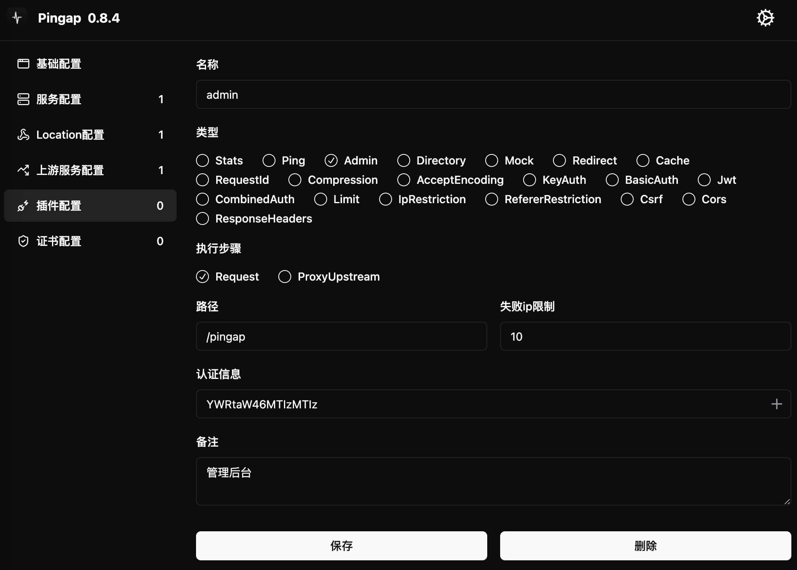

## Directory

The Directory plugin provides static file serving functionality, supporting file browsing and downloads.

### Configuration Example

```toml
[plugins.downloadsServe]
category = "directory"
path = "~/Downloads"
chunk_size = "4kb"
max_age = "1h"
private = true
index = "index.html"
charset = "utf-8"
autoindex = true
download = true
headers = [
    "X-Server:pingap",
]
```

### Configuration Parameters

- `path`: Static file directory path
- `chunk_size`: HTTP chunked transfer size, default `8kb`
- `max_age`: HTTP cache time
  - No cache by default
  - Cache always disabled for `text/html` type
  - e.g., `1h` means cache for 1 hour
- `private`: Whether to set cache as `private` (default is `public`)
- `index`: Default index filename, defaults to `index.html`
- `charset`: Specify character encoding, not set by default
- `autoindex`: Whether to enable directory browsing
  - When enabled, `index` parameter will be ineffective
- `download`: Whether to enable file downloads
  - When enabled, sets `Content-Disposition` response header
- `headers`: Custom HTTP response header list
- `step`: Plugin execution timing, can be either `request` or `proxy_upstream`

### Usage

Configure static file directory path in interface and adjust other parameters as needed:

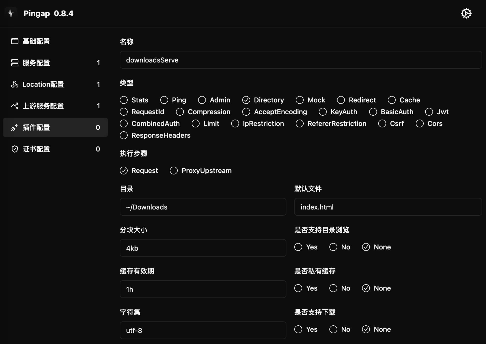

## Mock

The Mock plugin is used to simulate HTTP responses, useful for testing or temporary service degradation. Supports customizing response content, status codes, and response headers.

### Configuration Example

```toml
[plugins.errorMock]
category = "mock"
data = '{"error": "error message"}'
delay = "1s"
headers = [
    "X-Error:CustomError",
    "Content-Type:application/json",
]
path = "/"
status = 500
step = "request"
```

### Configuration Parameters

- `data`: Simulated response data
  - For different data types, corresponding `Content-Type` needs to be specified in `headers`
- `headers`: Custom response header list
- `path`: Request path that needs response simulation
  - If not configured, matches all paths
- `status`: HTTP response status code
- `delay`: Response delay time
- `step`: Plugin execution timing, can be either `request` or `proxy_upstream`

### Usage

Configure response data and related parameters in the interface, ensuring correct Content-Type is set according to response data type:

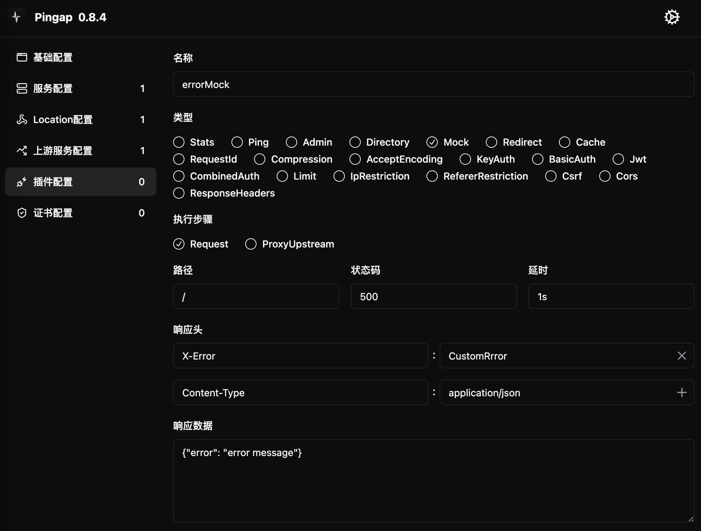

## Redirect

The Redirect plugin is used for HTTP request redirection, supporting URL prefix addition or redirecting HTTP requests to HTTPS.

### Configuration Example

```toml
[plugins.http2https]
category = "redirect"
http_to_https = true
prefix = "/api"
step = "request"
```

### Configuration Parameters

- `http_to_https`: Whether to redirect HTTP requests to HTTPS
- `prefix`: URL prefix to add during redirection
- `step`: Plugin execution timing, only supports `request`

### Usage

Configure redirection parameters in the interface:
- Enable HTTPS redirection: check `http_to_https`
- Add URL prefix: fill in the `prefix` field (optional)

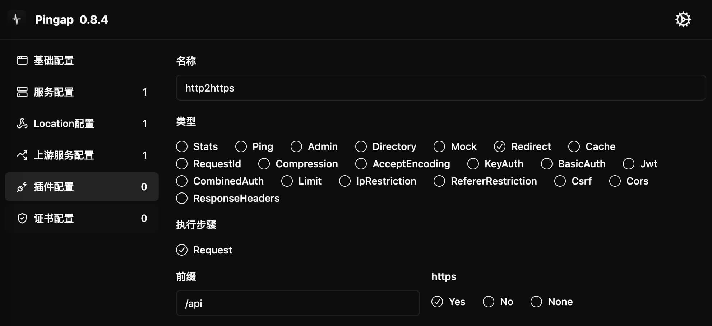

## Cache

Cache middleware for HTTP request caching. Since the cache module is used globally, to avoid conflicts with same URLs, it's recommended that each location uses different plugins and sets different namespaces.

### Configuration Example

```toml
[plugins.chartsCache]
category = "cache"
eviction = true
headers = ["Accept-Encoding"]
lock = "3s"
max_file_size = "100kb"
max_ttl = "1h"
namespace = "charts"
predictor = true
purge_ip_list = [
    "127.0.0.1",
    "192.168.1.1/24"
]
```

### Configuration Parameters

- `lock`: Wait time for same requests when cache doesn't exist, default 1 second
  - Used to avoid cache penetration
- `max_file_size`: Maximum size for single cache file, default 1MB
  - Recommend setting reasonable value to avoid large responses consuming too much memory
- `namespace`: Cache namespace
  - Cache key generated based on path + querystring
  - Recommend using different namespaces for multi-domain scenarios
  - Corresponds to separate directory for file caching
- `max_ttl`: Maximum cache validity period
  - When upstream response's `Cache-Control` `max-age` is long, recommend setting shorter `s-maxage`
  - When upstream hasn't set `s-maxage`, can limit cache time through this config
- `eviction`: Whether to enable cache eviction mechanism
  - Triggers eviction when cache exceeds limit
  - File cache automatically cleans long-unused cache, can be left unset
- `predictor`: Whether to record uncacheable requests
  - Avoids repeated determination of request cacheability
- `headers`: Request header list to be part of cache key
  - Configure when response depends on certain request headers
  - Example: include `Accept-Encoding` when upstream supports different compression algorithms
- `purge_ip_list`: IP list allowed to execute purge requests, empty by default
- `skip`: Regular expression to skip caching, empty by default
  - Used to quickly skip cache determination for certain requests
- `step`: Plugin execution timing, only supports `request`

### Interface Configuration

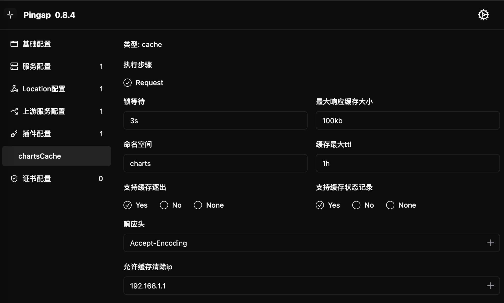

## RequestId

Adds a unique identifier for each request. By default, added to the `X-Request-Id` request header (header name can be customized). If the request header already exists, the original value is preserved.

### Configuration Example

```toml
[plugins.customReqId]
algorithm = "nanoid"  # Options: uuid or nanoid
category = "request_id"
size = 8              # nanoid length, only effective when algorithm=nanoid
header = "X-Request-Id"  # Optional: custom header name
step = "request"      # Optional: request or proxy_upstream
```

### Configuration Parameters

- `algorithm`: Algorithm for generating request ID
  - `uuid`: Uses UUID v4 format
  - `nanoid`: Uses NanoID format (shorter, URL safe)
- `size`: NanoID length, only effective when algorithm=nanoid
- `header`: Custom request header name, defaults to `X-Request-Id`
- `step`: Plugin execution timing, can be either `request` or `proxy_upstream`

### Use Cases

- Request tracing: Facilitates request path tracing in distributed systems
- Log correlation: Correlates logs from different services using request ID
- Problem troubleshooting: Quickly locate issues using request ID

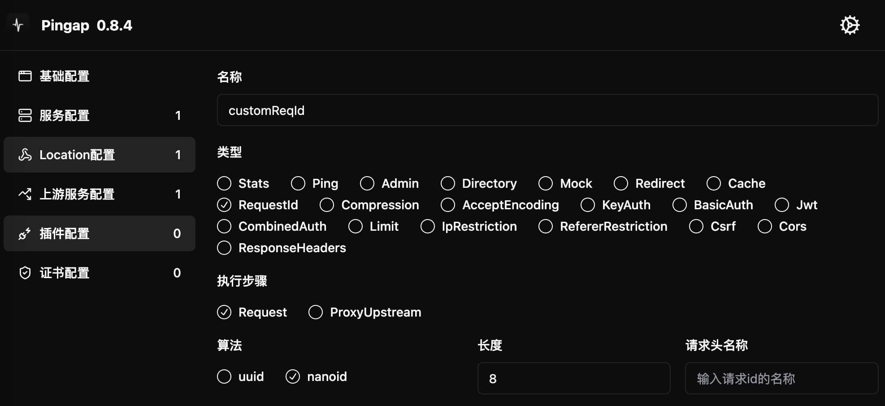

## Compression

HTTP response compression plugin for handling upstream return data compression. Supports three compression algorithms: gzip, brotli(br), and zstd.

### Working Principle

Since Pingora's default compression algorithm matching order is `gzip --> br --> zstd`, and modern browsers' support for these algorithms is:
- gzip: Almost universally supported
- br(brotli): Mostly supported
- zstd: Partially supported

To optimize compression effect, this plugin adjusts the `Accept-Encoding` header to prioritize algorithms as `zstd --> br --> gzip`.

### Configuration Example

```toml
[plugins.commonCompression]
category = "compression"
br_level = 6      # brotli compression level (0-11)
gzip_level = 6    # gzip compression level (0-9)
zstd_level = 5    # zstd compression level (0-22)
decompression = true
```

### Configuration Parameters

- `br_level`: brotli compression level, range 0-11, 0 means disabled
- `gzip_level`: gzip compression level, range 0-9, 0 means disabled
- `zstd_level`: zstd compression level, range 0-22, 0 means disabled
- `decompression`: Whether to decompress upstream returned compressed data

### Built-in Configuration

You can use the built-in `pingap:compression` plugin, which has default configuration:
- gzip_level = 6
- br_level = 6
- zstd_level = 3

### Execution Phase

Plugin is fixed to execute in `early_request` phase, no need to manually specify.

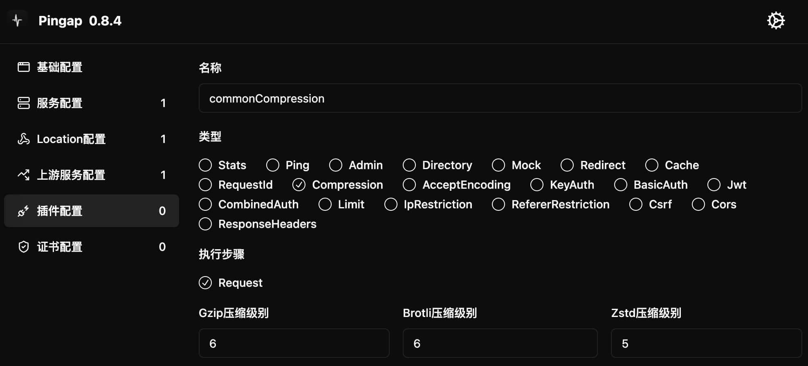

## AcceptEncoding

Used to manage and optimize HTTP request's Accept-Encoding header, allowing customization of supported compression algorithms and their priority order.

### Configuration Example

```toml
[plugins.acceptEncoding]
category = "accept_encoding"
encodings = "zstd, br, gzip"    # Supported encodings and priority order
only_one_encoding = true        # Whether to use single encoding only
```

### Configuration Parameters

- `encodings`: Specifies supported compression algorithms and their priority order
  - Multiple algorithms separated by commas
  - Order from left to right represents priority from high to low
  - Supported algorithms: zstd, br(brotli), gzip
- `only_one_encoding`: Whether to keep only one encoding method
  - `true`: Only use highest priority supported encoding
  - `false`: Keep all supported encodings, sorted by priority

### Execution Phase

Plugin is fixed to execute in `early_request` phase, no need to manually specify.

## KeyAuth

Provides a simple API key authentication mechanism, supporting authentication information retrieval from request parameters (query) or request headers. Can configure multiple valid keys to facilitate multi-system access.

### Configuration Example

#### Getting Authentication from Request Parameters

```toml
[plugins.queryAuth]
category = "key_auth"
query = "app"           # Get key from URL parameter 'app'
keys = [               # List of allowed keys
    "KOXQaw",
    "GKvXY2",
]
delay = "1s"
hide_credentials = true
step = "request"
```

#### Getting Authentication from Request Headers

```toml
[plugins.headerAuth]
category = "key_auth"
header = "X-App"        # Get key from X-App header
keys = [               # List of allowed keys
    "KOXQaw",
    "GKvXY2",
]
delay = "1s"
hide_credentials = true
step = "request"
```

### Configuration Parameters

- `query`: Parameter name to get key from request parameters
- `header`: Header name to get key from request headers
  - Choose either `query` or `header`, if both configured, `query` takes priority
- `keys`: List of allowed keys
- `delay`: Response delay time for authentication failure
- `hide_credentials`: Whether to remove authentication info when forwarding request
- `step`: Plugin execution timing, can be either `request` or `proxy_upstream`

### Interface Configuration

Configure key retrieval method (request parameters or headers) and corresponding valid key list:

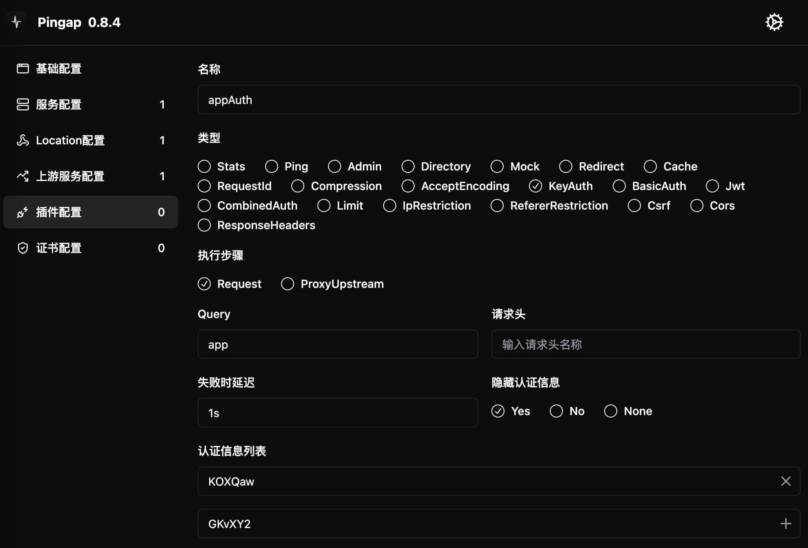

## BasicAuth

Provides HTTP Basic Authentication functionality. Supports configuring multiple username/password pairs, must be configured in base64 encoded format.

### Configuration Example

```toml
[plugins.testBasicAuth]
authorizations = [
    "YWRtaW46dGVzdA==",    # admin:test
    "YWRtaW46MTIzMTIz",    # admin:123123
]
category = "basic_auth"
delay = "1s"
hide_credentials = true
step = "request"
```

### Configuration Parameters

- `authorizations`: List of authentication credentials
  - Format is `base64(username:password)`
  - Can configure multiple credentials
- `delay`: Response delay time for authentication failure
- `hide_credentials`: Whether to remove authentication info when forwarding request
- `step`: Plugin execution timing, only supports `request`

### Usage Instructions

1. Concatenate username and password in `username:password` format
2. Base64 encode the concatenated result
3. Add the encoded string to the `authorizations` list

For example:
- `admin:test` -> `YWRtaW46dGVzdA==`
- `admin:123123` -> `YWRtaW46MTIzMTIz`

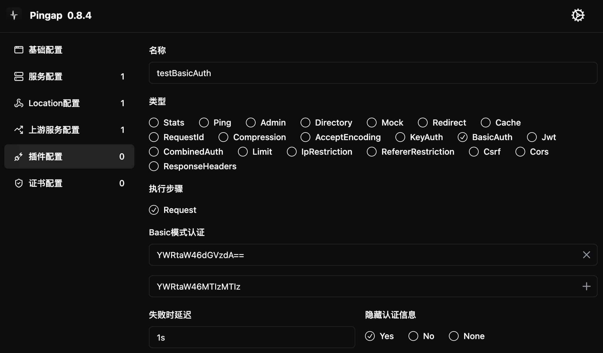

## JWT

Provides JWT (JSON Web Token) authentication functionality. Includes two main functions:
1. Generate JWT token at specified path
2. Verify if JWT token carried in request is valid

### Configuration Example

```toml
[plugins.jwtAuth]
algorithm = "HS256"
auth_path = "/jwt-sign"
category = "jwt"
delay = "1s"
header = "X-Jwt"
secret = "123123"
step = "request"
```

### Configuration Parameters

- `auth_path`: Path used to generate JWT token
  - When accessing this path, response data will be used as payload to generate token
- `algorithm`: JWT signing algorithm, currently supports HS256
- `secret`: Signing key
- `header`: Header field name to get token from request
- `cookie`: Cookie field name to get token from
- `query`: URL parameter name to get token from
  - Token retrieval priority: header > cookie > query
  - At least one of these three parameters must be configured
- `delay`: Response delay time for authentication failure
- `step`: Plugin execution timing, only supports `request`

### Workflow

1. Generate token:
   - Access path configured in `auth_path`
   - Use response data as payload to sign and generate token
   - Return generated token

2. Verify token:
   - When accessing other paths, get token according to priority
   - Verify token signature and validity
   - Continue processing if verification passes, otherwise return authentication error

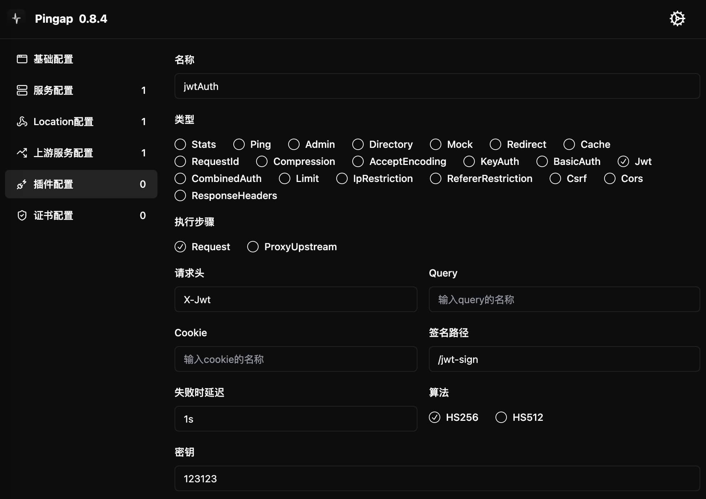

## CombinedAuth

Provides combination authentication mechanism based on application ID, key, and timestamp. Supports configuring independent authentication parameters and IP whitelist for each application.

### Configuration Example

```toml
[plugins.appAuth]
category = "combined_auth"
step = "request"

[[plugins.appAuth.authorizations]]
app_id = "pingap"
deviation = 10
ip_list = [
    "192.168.1.1/24",
    "127.0.0.1",
]
secret = "123123"
```

### Configuration Parameters

- `app_id`: Application identifier
- `secret`: Key used for generating digest
- `deviation`: Allowed timestamp deviation (in seconds)
  - Used to handle cases where client and server time are not perfectly synchronized
- `ip_list`: IP whitelist allowed to access
  - Supports single IP and CIDR format networks
- `step`: Plugin execution timing, only supports `request`

### Authentication Process

1. Client constructs request parameters:
   - `app_id`: Configured application identifier
   - `ts`: Current timestamp
   - `digest`: Digest value calculated using SHA256 algorithm
     - Calculation formula: `SHA256(secret:timestamp)`

2. Request example:
```
GET /api?app_id=pingap&ts=1727582506&digest=85c623c389177a69860adfd572212507ef98c197ba5105677919e0663eeae091
```

3. Server verification:
   - Check if request IP is in whitelist
   - Verify if timestamp is within allowed deviation range
   - Calculate digest using same algorithm and compare

## Limit

Provides access restriction functionality based on multiple conditions. Supports two types of limitations: concurrent connections (inflight) and access rate (rate), which can be restricted based on Cookie, request headers, URL parameters, or IP address.

### Configuration Parameters

- `type`: Limitation type
  - `inflight`: Concurrent access limit
  - `rate`: Access frequency limit
- `tag`: Restriction condition source
  - `cookie`: Get from Cookie
  - `header`: Get from request header
  - `query`: Get from URL parameter
  - `ip`: Based on visitor IP
- `key`: Field name to get limitation value
  - Not required when using `ip` type
- `max`: Maximum allowed value
- `interval`: Statistics time interval (only for rate type)
- `step`: Plugin execution timing, can be either `request` or `proxy_upstream`

### Configuration Examples

1. Cookie-based concurrent limit:
```toml
[plugins.cookieBigTreeLimit]
category = "limit"
type = "inflight"
tag = "cookie"
key = "bigtree"
max = 10
step = "request"
```

2. Header-based concurrent limit:
```toml
[plugins.headerAppLimit]
category = "limit"
type = "inflight"
tag = "header"
key = "X-App"
max = 10
```

3. URL parameter-based rate limit:
```toml
[plugins.queryAppLimit]
category = "limit"
type = "rate"
tag = "query"
key = "app"
max = 10
interval = "1s"
```

4. IP-based rate limit:
```toml
[plugins.ipLimit]
category = "limit"
type = "rate"
tag = "ip"
max = 10
interval = "1m"
```

### Additional Notes

- IP retrieval priority: X-Forwarded-For > X-Real-Ip > Remote Addr
- No limit applied when restriction condition value is empty
- Rate limit requires `interval` parameter
- Concurrent limit does not need `interval` parameter

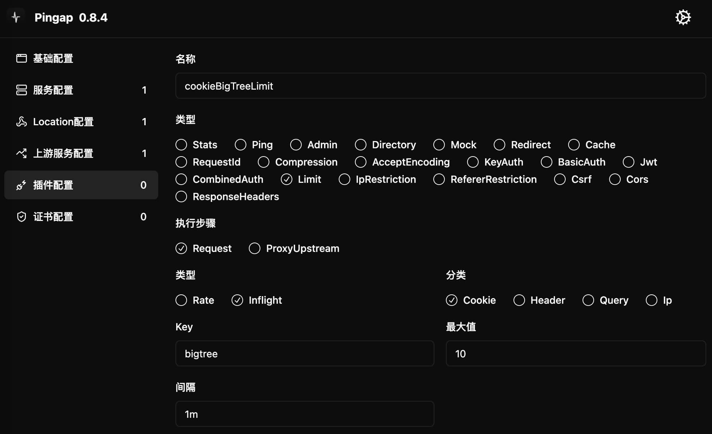

## IpRestriction

Provides access control functionality based on IP addresses. Supports setting either allow or deny modes, can configure single IP addresses or CIDR format networks.

### Configuration Example

```toml
[plugins.ipDeny]
category = "ip_restriction"
ip_list = [
    "192.168.1.1",      # Single IP address
    "1.1.1.0/24",       # CIDR format network
]
message = "IP access denied"
step = "request"
type = "deny"
```

### Configuration Parameters

- `type`: Access control mode
  - `allow`: Only allow IPs in list to access
  - `deny`: Block IPs in list from accessing
- `ip_list`: IP address list
  - Supports single IP addresses
  - Supports CIDR format networks
- `message`: Message shown when access is denied
- `step`: Plugin execution timing, only supports `request`

### Usage Instructions

1. Select access control mode (allow/deny)
2. Add IP addresses or networks that need to be controlled
3. Configure message shown when access is denied

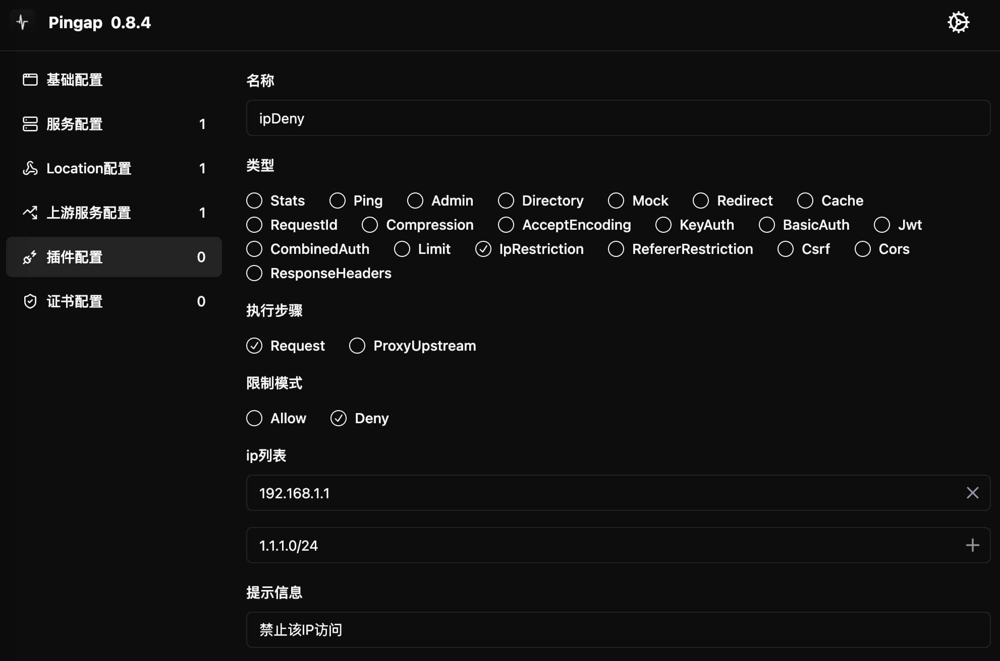

## UaRestriction

Provides access control functionality based on User-Agent. Supports setting either allow or deny modes, can use regular expressions for matching.

### Configuration Example

```toml
[plugins.userAgentDeny]
category = "ua_restriction"
ua_list = [
    "go-http-client/1.1",                  # Exact match
    "(Twitterspider)/(\\d+)\\.(\\d+)"     # Regex match
]
message = "Access denied"
step = "request"
type = "deny"
```

### Configuration Parameters

- `type`: Access control mode
  - `allow`: Only allow User-Agents matching list
  - `deny`: Block User-Agents matching list
- `ua_list`: User-Agent matching rule list
  - Supports exact matching
  - Supports regular expression matching
- `message`: Message shown when access is denied
- `step`: Plugin execution timing, only supports `request`

### Usage Instructions

1. Select access control mode (allow/deny)
2. Add User-Agent matching rules
   - Enter complete User-Agent string for exact matching
   - Use regular expressions to match specific patterns
3. Configure message shown when access is denied

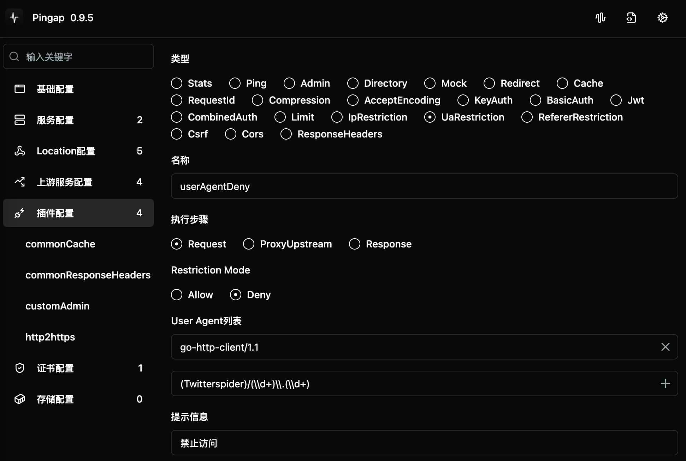

## RefererRestriction

Provides access control functionality based on HTTP Referer. Supports setting either allow or deny modes, can use wildcards (*) for domain matching.

### Configuration Example

```toml
[plugins.referer]
category = "referer_restriction"
referer_list = [
    "*.github.com",     # Match all github.com subdomains
    "example.com"       # Exact match
]
message = "Access denied"
step = "request"
type = "allow"
```

### Configuration Parameters

- `type`: Access control mode
  - `allow`: Only allow Referers matching list
  - `deny`: Block Referers matching list
- `referer_list`: Referer matching rule list
  - Supports exact matching
  - Supports using * as wildcard for subdomain matching
- `message`: Message shown when access is denied
- `step`: Plugin execution timing, only supports `request`

### Usage Instructions

1. Select access control mode (allow/deny)
2. Add Referer matching rules
   - Enter domain directly for exact matching
   - Use `*.domain.com` format to match all subdomains
3. Configure message shown when access is denied

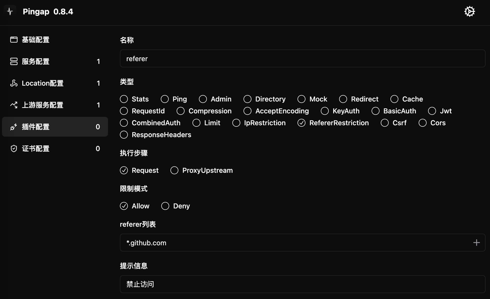

## CSRF

Provides Cross-Site Request Forgery protection functionality. Verifies request legitimacy by comparing token values in cookie and request header.

### Configuration Example

```toml
[plugins.csrf]
category = "csrf"
key = "WjrXUG47wu"
name = "x-csrf-token"
token_path = "/csrf-token"
ttl = "1h"
```

### Configuration Parameters

- `key`: Key used for generating token
- `name`: CSRF token name
  - Used as both cookie name and request header name
- `token_path`: Path to get token
  - New token will be generated when accessing this path
  - Sets same-named cookie with SameSite protection enabled
- `ttl`: Token validity period
- `step`: Plugin execution timing, only supports `request`

### Workflow

1. Get token:
   - Client accesses path configured in `token_path`
   - Server generates token and sets it in cookie
   - Cookie set to SameSite mode for enhanced security

2. Request verification:
   - Client carries token in request header
   - Server compares tokens in request header and cookie
   - Request rejected if they don't match

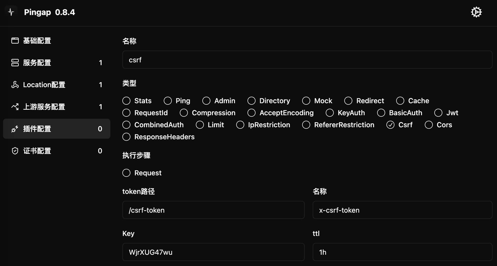

## CORS

Provides Cross-Origin Resource Sharing configuration functionality for controlling browser cross-origin access policies.

### Configuration Example

```toml
[plugins.cors]
allow_credentials = true
allow_headers = "Content-Type, X-User-Id"
allow_methods = "GET, POST, OPTIONS"
allow_origin = "$http_origin"
category = "cors"
expose_headers = "Content-Type, X-Device"
max_age = "1h"
path = "^/api"
step = "request"
```

### Configuration Parameters

- `allow_origin`: Allowed cross-origin request sources
  - Can specify specific domain like `https://example.com`
  - Set to `$http_origin` to allow request origin, not recommended for production
  - Recommend explicitly specifying allowed domain list
- `allow_credentials`: Whether to allow carrying authentication information
  - Includes Cookie, HTTP authentication and client SSL certificates
- `allow_methods`: Allowed HTTP request methods
  - Multiple methods separated by commas, like `GET, POST, OPTIONS`
- `allow_headers`: Allowed custom request headers
  - Multiple headers separated by commas
- `expose_headers`: Response headers browser is allowed to access
  - Browsers can only access basic response headers by default
  - Can expose custom response headers through this parameter
- `max_age`: Cache time for preflight request results
- `path`: CORS configuration effective path range
  - Supports regular expression matching
- `step`: Plugin execution timing, only supports `request`

### Security Recommendations

1. Avoid using `$http_origin`, explicitly specify allowed domains
2. Only configure necessary request methods and headers
3. Be cautious with `allow_credentials`, may bring security risks
4. Set reasonable `max_age` to balance performance and security

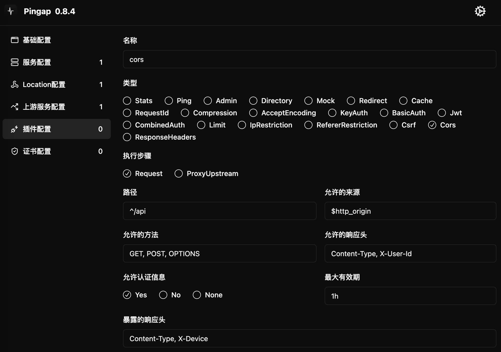

## ResponseHeaders

Provides HTTP response header management functionality, supporting adding, setting, and removing response headers. Supports using variable references:
- `$hostname`: Reference server hostname
- `$variable_name`: Reference environment variable value

### Configuration Example

```toml
[plugins.commonResponseHeaders]
add_headers = ["X-Server:pingap"]
category = "response_headers"
remove_headers = ["X-User"]
set_headers = ["X-Response-Id:123"]
step = "response"
```

### Configuration Parameters

- `add_headers`: Response headers to add
  - Won't override existing headers with same name
- `set_headers`: Response headers to set
  - Will override existing headers with same name
- `remove_headers`: Response headers to remove
  - Removes headers with specified names
- `step`: Plugin execution timing, only supports `response`

### Execution Order

Operations execute in following order:
1. `add_headers`: Add new response headers
2. `remove_headers`: Remove specified response headers
3. `set_headers`: Set (override) response headers

### Usage Instructions

1. Configure headers to add, set, or remove as needed
2. Each configuration item is optional, can omit if not needed
3. Header values can use variables:
   - `$hostname` gets server hostname
   - `$VARIABLE_NAME` gets environment variable value

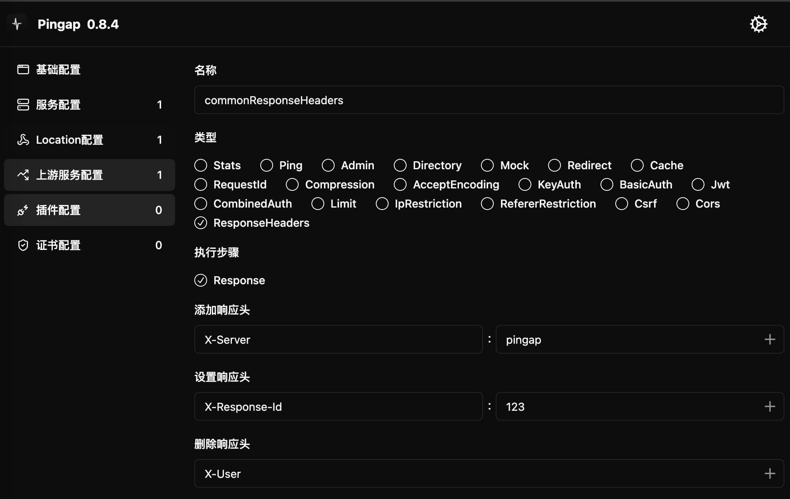
