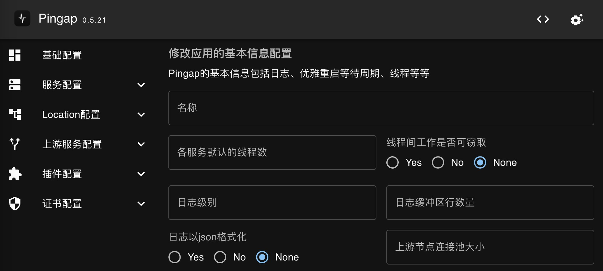
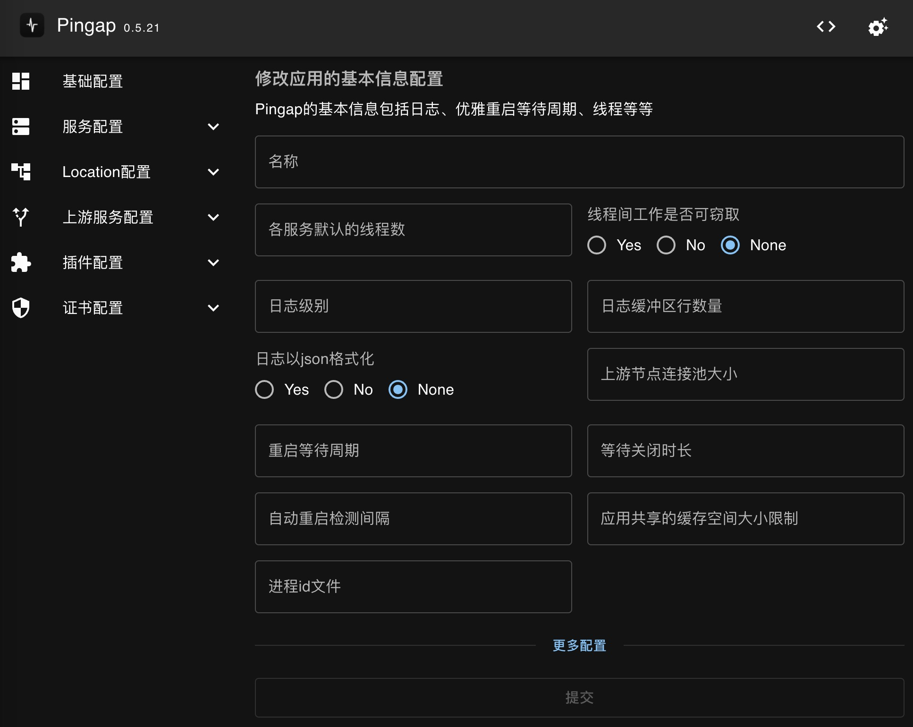
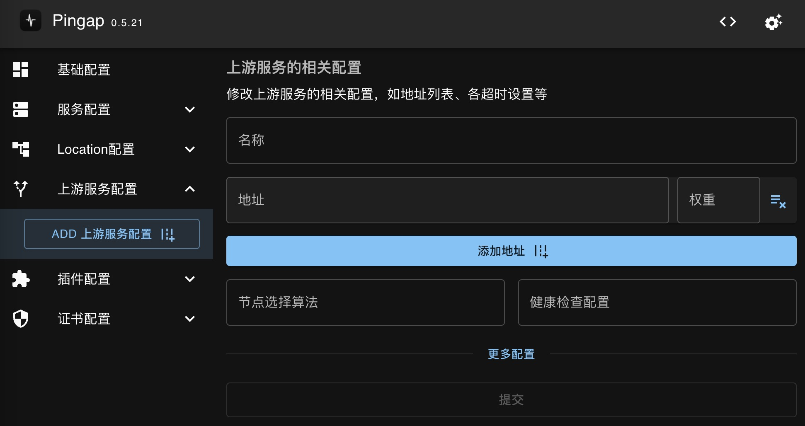
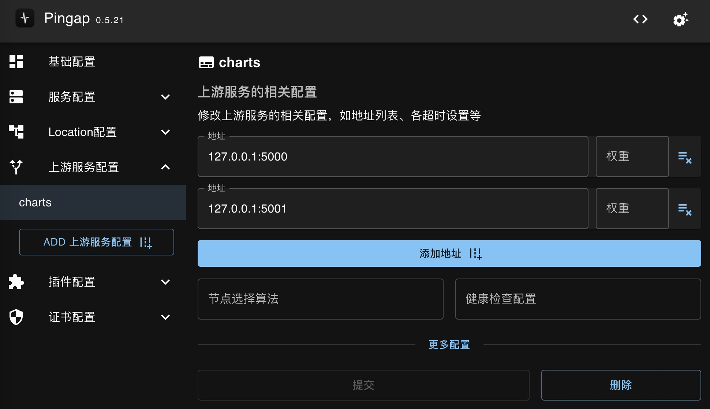
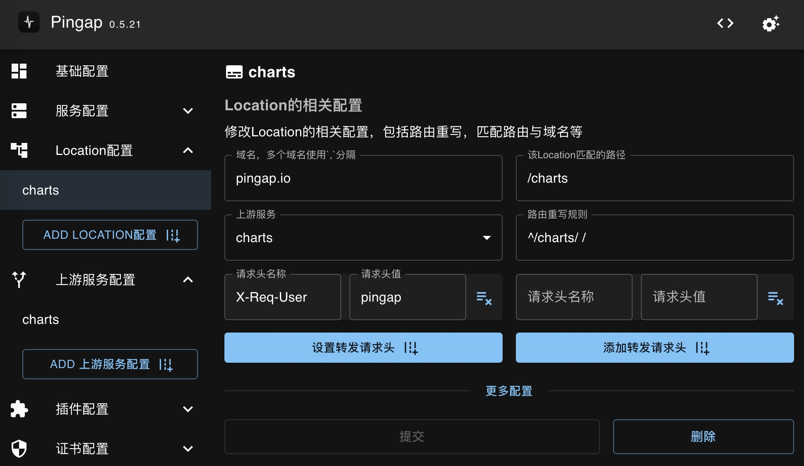
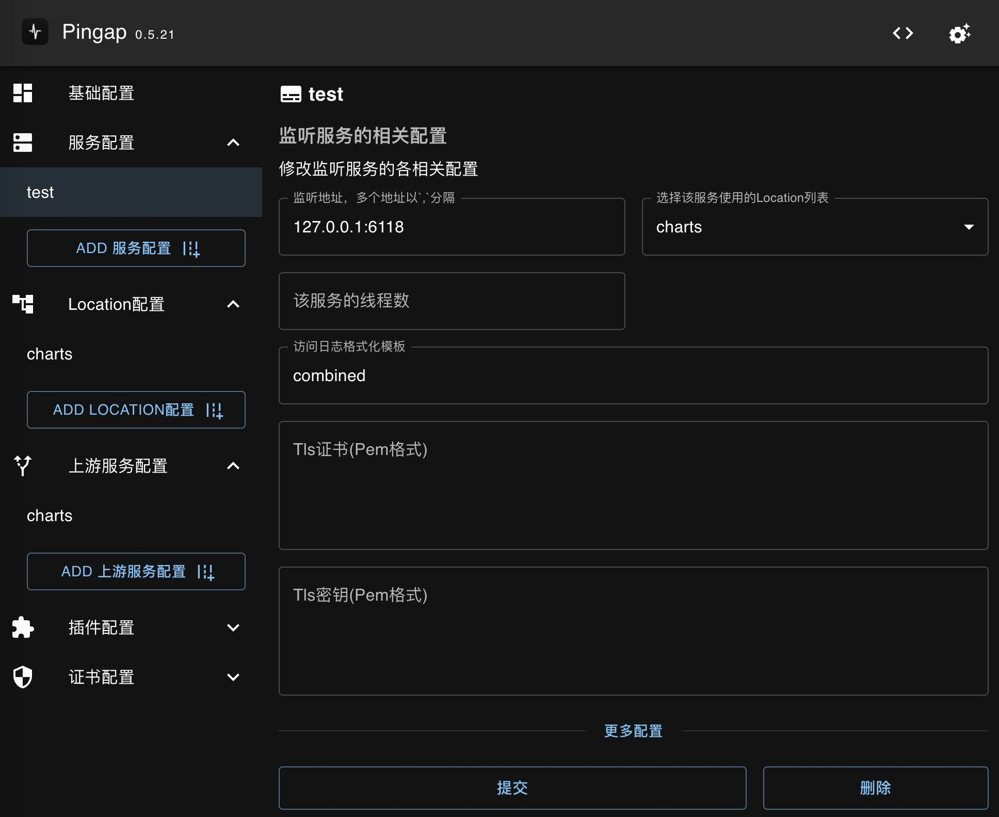

# 入门教程

本章节介绍如何从零开始创建反向代理服务。若需要使用upgrade形式更新配置，pingap需要以后台进程的形式运行。

对于配置更新，pingap提供两种模式：

1. **热更新模式** (`--autoreload`):
   - 适用于 upstream、location、certificate 和 plugin 等配置的更新
   - 无需重启即可生效
   - 建议用于仅需要热更新支持的场景

2. **重启更新模式** (`--autorestart`):
   - 适用于 server 等基础配置的更新
   - 需要重启服务才能生效
   - 建议在需要频繁更改基础配置的场景使用

## 选择配置存储目录

pingap支持文件和etcd两种配置存储方式。两种方式仅在启动参数上有所不同，本示例选择使用更简单的文件存储方式。

在使用文件存储配置时，pingap提供两种模式：

1. 目录模式（推荐）：
   - 指定一个目录作为配置路径
   - 按不同类别自动生成多个toml配置文件
   - Web管理界面默认使用此模式

2. 单文件模式：
   - 指定一个文件作为配置路径
   - 所有配置都保存在同一个文件中

启动示例：
```bash
RUST_LOG=INFO pingap -c /opt/pingap/conf
```

启动后，pingap会自动加载指定目录下的所有toml配置文件。示例中的目录为空，因此暂时不会产生实际效果。

## 启用WEB管理后台配置

toml的相关配置可以查阅[应用配置详细说明](/pingap-zh/docs/config)。建议使用WEB管理后台进行配置，它支持以下认证方式：

1. Basic Auth认证（可选）
2. Base64编码的认证字符串

### 基本用法

```bash
# 使用用户名密码方式
RUST_LOG=INFO pingap -c /opt/pingap/conf --admin=pingap:123123@127.0.0.1:3018

# 使用Base64编码方式 (base64("pingap:123123"))
RUST_LOG=INFO pingap -c /opt/pingap/conf --admin=cGluZ2FwOjEyMzEyMw==@127.0.0.1:3018

# 复用已有端口并指定路径前缀
sudo RUST_LOG=INFO pingap -c /opt/pingap/conf --admin=pingap:123123@127.0.0.1:80/pingap
```

默认配置说明：
- 管理后台地址：`http://127.0.0.1:3018/`
- 默认账号：pingap
- 默认密码：123123
- 安全限制：多次密码错误的IP会被锁定5分钟



启动成功后，访问管理后台地址 `http://127.0.0.1:3018/` 即可进入配置界面。该界面提供了完整的配置管理功能，包括基础配置、上游服务、路由规则等，我们将在后续章节逐一详细介绍。

:::caution 安全提示
为了防止暴力破解，管理后台采用了登录保护机制：同一IP多次输入错误密码将被临时锁定5分钟。
:::

## 基础配置

基础配置通常可以保持默认值，无需特别调整。但在以下情况需要注意：

- 当在同一台机器上运行多个 pingap 实例时：
  - 必须为每个实例设置不同的`进程id文件`
  - 必须为每个实例设置不同的`upgrade sock`路径

:::tip 最佳实践
不建议在同一台机器上运行多个 pingap 实例。如果需要支持多个服务端口，建议通过配置不同的 server 来实现。
:::



## 上游服务配置

由于配置存在依赖关系，我们需要先配置上游服务。在管理界面中点击"添加上游服务"按钮进行配置：



### 基本配置
- 地址格式为 `ip:端口`
- 默认使用 HTTP 协议
- 如果配置了 `sni`，则自动使用 HTTPS 协议访问上游节点

### 高级配置
虽然大多数配置项都有默认值，但建议展开高级配置面板：



1. **超时设置**
   - 建议根据实际需求设置各类超时值
   - 不建议使用默认的无超时设置

2. **HTTPS 相关**
   - `sni`：用于 HTTPS 连接的服务器名称指示
   - `是否校验证书`：控制 HTTPS 证书验证
   - 如果使用 HTTP 协议则可忽略这些设置

3. **健康检查**
   - 示例：`http://charts/ping`
   - 其中 `charts` 为请求时的 Host 头
   - 健康检查直接连接配置的 upstream 地址
   - 注意：不会在检查时解析域名

## Location配置

Location配置主要用于设置请求路由规则，包括域名(host)、路径(path)以及对应的上游服务。配置界面如下：



### 域名(Host)配置
- 根据服务域名进行设置
- 支持多域名配置：使用`,`分隔多个域名
- 支持正则表达式：以`~`开头
- 如果所有服务使用相同域名，可以不设置

### 路径(Path)配置
- 用于将不同路径前缀转发至对应服务
- 支持多种匹配规则（详见 location 配置说明文档）

### 请求头处理
支持两种处理方式：
1. **设置转发请求头**
   - 若存在则覆盖原有请求头的值，不存在则添加
   - 适用于 `Host` 等唯一请求头

2. **添加转发请求头**
   - 保留原有请求头
   - 添加新的请求头值

### 路由重写
- 使用正则表达式配置
- 格式：`匹配值 替换值`（以空格分隔）

:::tip 注意事项
当上游服务(upstream)本身是反向代理且基于host匹配时，需要在location配置中设置相应的 `Host` 请求头。
:::

## 服务配置

服务配置主要包含以下几个关键部分：

### 监听地址
- 支持配置多个服务地址，使用`,`分隔
- 同时支持 IPv4 和 IPv6
- 示例：`127.0.0.1:3001,[::1]:3001`（同时监听 IPv4 和 IPv6 的 3001 端口）

### 访问日志
- 需要配置格式化模板才会生成访问日志
- 提供四种预设类型：
  - `tiny`
  - `short`
  - `common`
  - `combined`
- 建议：根据实际需求自定义日志格式，而不是使用预设类型

### 服务线程
- 默认线程数：1
- 适用场景：一般的转发服务已足够使用
- 注意：增加线程数并不会带来线性的性能提升



## 程序后台运行及自动重启

程序的配置均已完成，由于此时程序加载的配置非最新版本，因此需要重启程序加载新的配置。Pingap也支持判断配置是否有更新，若有更新则自动触发upgrade的操作，拉起新的实例并关闭当前实例。

最后调整后的程序启动命令为包括以下方面：

- 程序以后台服务运行
- 程序自动检测配置是否更新，若有更新则重启。若只是upstream与location等的更新，则准实时刷新，无需重启
- 日志写入至/opt/pingap/pingap.log

```bash
RUST_LOG=INFO pingap -c /opt/pingap/conf \
  -d --log=/opt/pingap/pingap.log \
  --autorestart \
  --admin=pingap:123123@127.0.0.1:3018
```

### 配置验证

1. 访问测试：
   - 打开浏览器访问 `http://127.0.0.1:6188/charts/`
   - 确认服务正常运行

2. 配置更新测试：
   - 修改 `location` 配置：将 path 从 `/charts` 改为 `/pingap`
   - 修改 `rewrite` 规则
   - 观察日志输出：
     ```
     2024-06-30T13:04:28.524079+08:00  INFO reload location success
     ```

### 重要说明

1. **配置更新机制**：
   - 配置检测间隔：
     - 常规重启检测：90秒
     - 热更新检测：10秒
   - 为避免频繁重启，配置更新生效有约2分钟延迟

2. **更新方式**：
   - 热更新支持：
     - `upstream`、`location`、`certificate`、`plugin` 等配置
     - 无需重启即可生效
   - 完整重启更新：
     - 仅在 Linux 系统下支持 upgrade 更新切换
     - 其他配置变更需要重启生效
