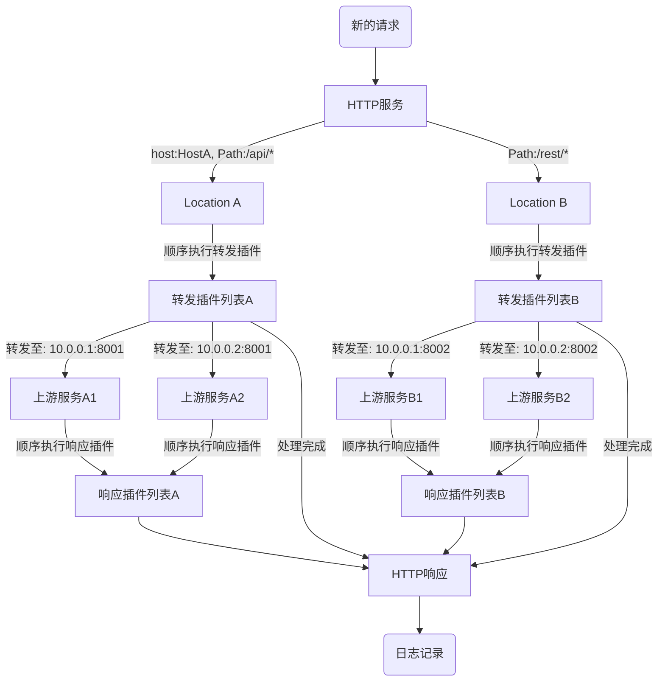

## 什么是 Pingap？

Pingap 是一款现代化、高性能的反向代理服务，它构建于 Cloudflare 开源的 Rust 框架 [Pingora](https://github.com/cloudflare/pingora) 之上。

Pingap 的核心使命是将 [Pingora](https://github.com/cloudflare/pingora) 框架强大的性能和稳定性，通过简洁的 TOML 配置和插件化体系，带给每一位开发者，即使您不熟悉 Rust 语言，也能轻松驾驭。

您可以随时从[Releases](https://github.com/vicanso/pingap/releases)页面下载适用于各种系统架构的预编译版本。

## 为什么选择 Pingap？

- 🚀 极致性能与可靠性
  继承自 Pingora 的异步多线程架构，提供极低延迟和高吞吐量的网络处理能力，确保您的服务稳定、高效。

- ✍️ 简单直观的配置
  告别复杂的配置语法。通过人性化的 TOML 文件或直观的 Web UI 界面，即可完成所有配置。支持配置热更新，实现零停机变更。

- 🧩 高度灵活的扩展
  强大的插件体系贯穿请求处理的完整生命周期，无论是认证、限流、缓存还是自定义逻辑，都能像积木一样轻松组合，满足各种复杂场景。

## 核心特性

强大的路由与负载均衡

- 精细化路由：支持基于 Host、Path 的多种匹配模式（前缀、正则、精确），轻松实现单服务的复杂路由分发。
- 灵活重写：内置强大的URL重写引擎，支持正则表达式，可轻松修改路径或添加前缀。
- 智能负载均衡：提供轮询、权重、会话保持（基于 IP、Header 等）等多种负载均衡策略。

现代化协议与安全

- 全面协议支持：完整支持 HTTP/1.x、HTTP/2，并能处理 gRPC-web 和 h2c 流量。
- 自动化 TLS：集成 Let's Encrypt，实现证书的自动申请与续期。支持基于 SNI 动态选择证书，轻松管理多域名 HTTPS 服务。

动态化与自动化

- 动态配置：支持从文件系统或 etcd 加载配置，核心配置（路由、上游等）变更可在 10秒内热加载，无需重启。
- 服务发现：除了静态地址配置，还支持基于 DNS 和 Docker Label 的动态服务发现，无缝对接容器化环境。

可观测性与运维

- 多维度监控：原生集成 Prometheus，轻松暴露丰富的性能指标，支持 Pull 和 Push 两种模式。
- 分布式追踪：内置 OpenTelemetry 支持，助力您构建完整的分布式调用链监控。
- 高度可定制日志：提供超过 30种 模板变量，让您随心所欲地定制访问日志格式。
- Web管理界面：提供开箱即用的 Web UI，让配置管理和服务状态监控更加直观。

## 请求处理流程

当一个 HTTP 请求到达 Pingap 时，它会经历一套标准化的处理流程。您可以将其理解为一条由多个处理站组成的流水线：

1、服务监听：Server 在指定端口接收到请求。
2、路由匹配：根据请求的 Host 和 Path，匹配到最合适的 Location 规则。
3、请求处理（插件）：在请求转发到上游服务前，顺序执行该 Location 绑定的请求插件（例如：认证、限流、请求头修改）。
4、转发至上游：根据负载均衡策略，将请求转发给一个健康的 Upstream 后端服务。
5、响应处理（插件）：接收到上游服务的响应后，顺序执行响应插件（例如：压缩、缓存、修改响应头）。
6、返回客户端：将最终处理过的响应返回给客户端。
7、记录日志：根据配置的格式，记录访问日志。

以下是该流程的可视化图解：

