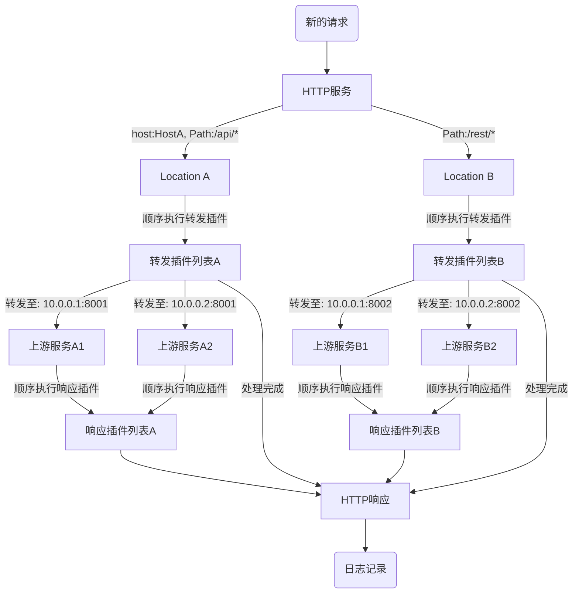

# Pingap简述

Pingap是基于[pingora](https://github.com/cloudflare/pingora)开发的反向代理服务。虽然pingora为Rust开发者提供了丰富的模块，但对非Rust开发者并不友好。因此，Pingap通过TOML配置文件提供了简单易用的反向代理功能，支持单服务多location转发，并可通过插件扩展更多功能。各架构的预编译可执行文件可在[releases](https://github.com/vicanso/pingap/releases)页面下载。

主要特性：

- 多Location支持：每个服务可配置多个Location，通过host与path匹配，按权重选择
- 灵活的路径重写：支持正则表达式配置Path重写，便于基于前缀的转发
- 完整的HTTP支持：
  - HTTP/HTTPS透明代理
  - HTTP 1.0/1.1/2.0全链路支持(含h2c)
  - grpc-web反向代理
- 多样化的服务发现：支持静态配置、DNS和docker label三种方式
- 简洁的配置方式：基于TOML格式，可存储于文件或etcd
- 丰富的监控指标：
  - 内置10+个Prometheus指标
  - 支持pull和push两种收集方式
  - OpenTelemetry支持(w3c context trace与jaeger trace)
- 动态配置更新：
  - Upstream、Location和Plugin配置10秒内生效，无请求中断
  - 其它配置更新通过优雅重启完成，确保服务连续性
- 可定制的访问日志：支持30+属性的模板配置
- 便捷的管理界面：提供Web管理后台，操作简单直观
- 完善的TLS支持：
  - 开箱即用的Let's Encrypt证书
  - 支持多域名证书
  - 单端口多域名证书按SNI自动匹配
- 事件通知机制：支持`lets_encrypt`、`backend_status`、`diff_config`、`restart`等事件推送
- 丰富的插件生态：提供缓存、压缩、认证、限流等多种功能组件

## 处理流程

Pingap核心部分功能主要处理以下逻辑(更丰富的功能则由各种不同的插件实现)：

- 根据path与host选择对应的location，path支持前缀、正则以及全匹配三种模式
- location根据配置重写path以及添加相应的请求头
- 执行相应的转发中间件
- 执行相应的响应中间件
- 根据配置的日志格式输出对应的访问日志

## 插件体系

Pingap的插件主要分为两类，请求前或响应后的处理，提供压缩、缓存、认证、流控等各种不同场景的应用需求。插件是添加至location的，可根据不同需求配置各种不同的插件后，在location添加对应的插件，实现不同的功能组合。注意插件是按顺序执行的，按需调整其顺序。

[插件体系](/pingap-zh/docs/plugin)

## 访问日志格式化

现在日志是按server来配置，因此该server下的所有location共用，已支持各种不同的占位符，按需配置不同的访问日志输出。

[日志格式化详细说明](/pingap-zh/docs/log)

## 应用配置

[应用配置详细说明](/pingap-zh/docs/config)
