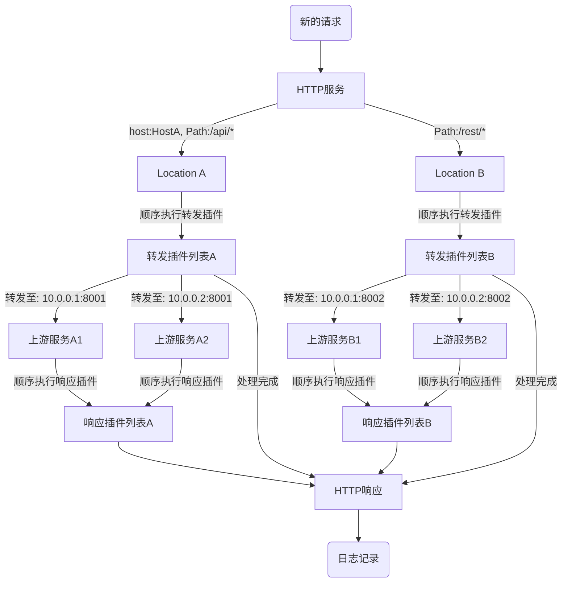

# Pingap简述

Pingap是一个基于[pingora](https://github.com/cloudflare/pingora)的反向代理服务。它通过简单的TOML配置文件，让非Rust开发者也能轻松使用pingora的强大功能。Pingap支持单服务多location转发，并提供丰富的插件扩展机制。你可以在[releases](https://github.com/vicanso/pingap/releases)页面下载各种架构的预编译版本。

主要特性：

- 多路由配置：
  - 支持单服务多Location配置
  - 基于host与path的精确匹配
  - 支持按权重的负载均衡
- 路由重写能力：
  - 支持正则表达式匹配
  - 灵活的路径重写规则
  - 便捷的前缀转发配置
- HTTP全协议支持：
  - HTTP/HTTPS反向代理
  - HTTP/1.0、1.1、2.0协议支持
  - h2c与grpc-web代理能力
- 服务发现机制：
  - 静态配置服务发现
  - DNS服务发现
  - Docker Label服务发现
- 配置管理：
  - 基于TOML的配置格式
  - 支持文件与etcd存储
  - 配置变更实时生效
- 可观测性支持：
  - Prometheus指标集成
  - 支持指标拉取与推送
  - OpenTelemetry分布式追踪
- 动态更新能力：
  - 核心配置热更新(10s内生效)
  - 优雅重启机制
  - 零停机配置更新
- 运维友好特性：
  - 可定制的访问日志(30+模板属性)
  - Web管理控制台
  - 完善的事件通知机制
- SSL/TLS支持：
  - 自动化Let's Encrypt证书
  - 多域名证书管理
  - 基于SNI的证书分发
- 扩展性设计：
  - 丰富的插件生态
  - 模块化的中间件体系
  - 完整的认证与安全机制

## 处理流程

Pingap核心部分功能主要处理以下逻辑(更丰富的功能则由各种不同的插件实现)：

- 根据path与host选择对应的location，path支持前缀、正则以及全匹配三种模式
- location根据配置重写path以及添加相应的请求头
- 执行相应的转发中间件
- 执行相应的响应中间件
- 根据配置的日志格式输出对应的访问日志

## 插件体系

Pingap的插件主要分为两类，请求前或响应后的处理，提供压缩、缓存、认证、限流等多种不同场景的应用需求。插件是添加至location的，可根据不同需求配置各种不同的插件后，在location添加对应的插件，实现不同的功能组合。注意插件是按顺序执行的，按需调整其顺序。

[插件体系](/pingap-zh/docs/plugin)

## 访问日志格式化

现在日志是按server来配置，因此该server下的所有location共用，已支持各种不同的占位符，按需配置不同的访问日志输出。

[日志格式化详细说明](/pingap-zh/docs/log)

## 应用配置

[应用配置详细说明](/pingap-zh/docs/config)
