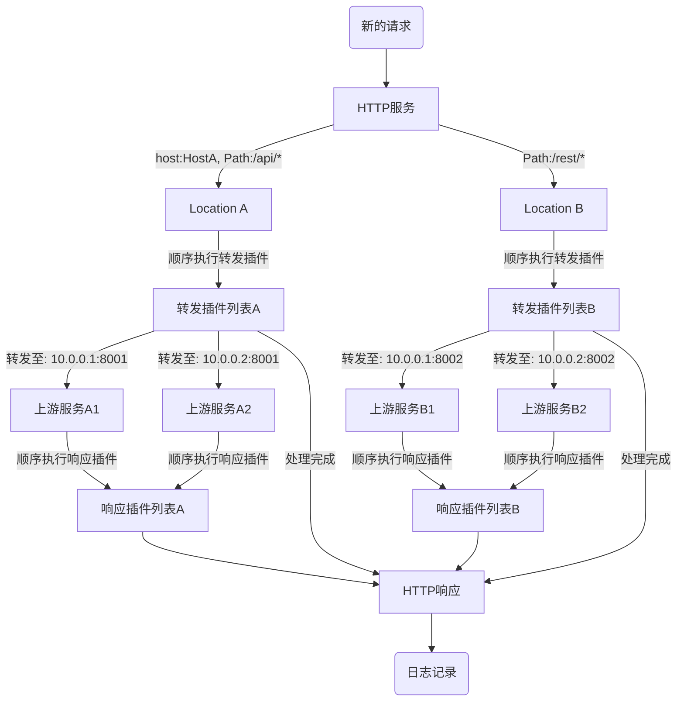

# Pingap简述


Pingap是基于[pingora](https://github.com/cloudflare/pingora)开发的，pingora提供了各类模块便于rust开发者使用，但并不方便非rust开发者，因此pingap支持toml的形式配置简单易用的反向代理，单服务支持多location转发，通过插件的形式支持更多的需求场景。已预编译好各架构上使用的可执行文件，在[releases](https://github.com/vicanso/pingap/releases)下载即可。特性如下：

- 服务支持配置多个Location，通过host与path筛选对应的location，按权重逐一匹配选择
- 支持正则形式配置重写Path，方便应用按前缀区分转发
- HTTP透明代理，支持http与https的代理转发
- HTTP 1/2 的全链路支持，包括h2c的支持
- 支持静态配置、DNS以及docker label的三种服务发现形式
- 支持grpc-web反向代理
- 基于TOML格式的配置，配置方式非常简洁，可保存至文件或etcd
- 已有10多个Prometheus指标，可以使用pull与push的形式收集相关指标
- Opentelemetry支持w3c context trace与jaeger trace的形式
- 频繁更新的Upstream、Location以及Plugin相关配置调整准实时生效(10秒)且无任何中断请求，其它应用配置更新后，无中断式的优雅重启程序
- 访问日志的模板化配置，已支持30多个相关属性的配置，可按需指定输出各种参数与指标
- WEB形式的管理后台界面，无需学习，简单易用
- 开箱即用的`let's encrypt`tls证书，仅需配置对应域名即可，可在单一配置中使用多个子域名
- 不同域名的tls证书可使用在同一服务端口中，按servername自动选择匹配证书
- 支持各种事件的推送：`lets_encrypt`, `backend_status`, `diff_config`, `restart`等等
- 丰富的http插件，如高效的缓存服务组件、多种压缩算法的压缩组件、不同种类的认证组件、不同形式的限流组件等等
- 提供了不同阶段的统计数据，如`upstream_connect_time`, `upstream_processing_time`, `compression_time`, `cache_lookup_time` 与 `cache_lock_time`等


## 处理流程




Pingap核心部分功能主要处理以下逻辑(更丰富的功能则由各种不同的插件实现)：

- 根据path与host选择对应的location，path支持前缀、正则以及全匹配三种模式
- location根据配置重写path以及添加相应的请求头
- 执行相应的转发中间件
- 执行相应的响应中间件
- 根据配置的日志格式输出对应的访问日志


## Location的处理逻辑

该Server下的所有location在初始化时根据权重按高至低排序，接收到请求时按顺序一个个匹配到符合的location为止，若无符合的则返回出错。在选择对应的location之后，判断是否有配置重写path(若无则不需要)，添加请求头(若无则不需要)。

```rust

let Some(locations) = get_server_locations(&self.name) else {
    return Ok(());
};

for name in locations.iter() {
    let Some(location) = get_location(name) else {
        continue;
    };
    let (matched, variables) = location.matched(host, path);
    if matched {
        ctx.location = Some(location);
        if let Some(variables) = variables {
            for (key, value) in variables.iter() {
                ctx.add_variable(key, value);
            }
        };
        break;
    }
}
```

[Location的详细说明](/pingap-zh/docs/location)

## 插件体系

Pingap的插件主要分为两类，请求前或响应后的处理，提供压缩、缓存、认证、流控等各种不同场景的应用需求。插件是添加至location的，可根据不同需求配置各种不同的插件后，在location添加对应的插件，实现不同的功能组合。注意插件是按顺序执行的，按需调整其顺序。

[插件体系](/pingap-zh/docs/plugin)

## Upstream的处理逻辑

Upstream的逻辑比较简单，在匹配location后，根据该location配置的upstream节点列表，按算法选择可用节点，并将请求转发至该节点即可。upstream有各种超时以及tcp相关的配置，建议按需配置而非使用默认值。

[Upstream的详细说明](/pingap-zh/docs/upstream)

## 访问日志格式化

现在日志是按server来配置，因此该server下的所有location共用，已支持各种不同的占位符，按需配置不同的访问日志输出。

[日志格式化详细说明](/pingap-zh/docs/log)

## 应用配置

[应用配置详细说明](/pingap-zh/docs/config)
