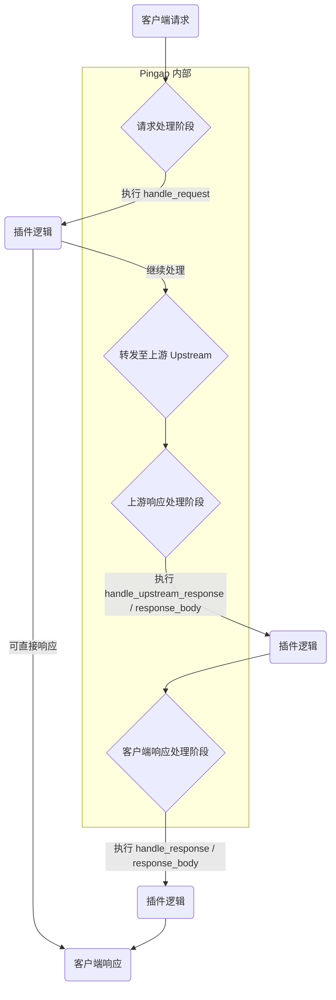

# 插件体系 (Plugin System)

插件是 `Pingap` 的核心扩展机制。通过为 `Location` 附加一系列插件，您可以实现认证、限流、缓存、内容修改、可观测性等各种复杂功能，灵活地定制请求和响应的处理流程。


## 核心理念：请求处理生命周期

要理解插件如何工作，首先需要了解一个请求在 `Pingap` 内部的完整生命周期。新的插件体系允许您在生命周期的多个关键节点（Hooks）挂载逻辑。

下面是请求处理的简化流程图：



如上图所示，插件主要可以在三个大的阶段内工作，每个阶段又分为对 Header 和 Body 的处理。

## 插件的执行时点与方法

一个插件可以实现 `Plugin` trait 中的多个方法，以在生命周期的不同节点执行特定逻辑。

1. 请求处理阶段 (`handle_request`)

这是插件介入的第一个时点，在 `Pingap` 对请求进行路由并转发到上游服务之前。

- 何时调用？：在请求处理的最开始。

- 主要用途？：
  - 访问控制：如 IP 黑白名单、API 密钥认证、JWT 验证。
  - 请求修改：添加、删除或修改请求头。
  - 流量控制：请求限流。
  - 短路请求：无需访问后端，直接返回一个响应（例如，返回 Mock 数据、维护页面或重定向）。

- 关键返回值 (`RequestPluginResult`)：
  - Continue: 请求被插件处理或修改后，继续后续流程。
  - Respond: 中断当前请求，并立即向客户端返回一个由插件生成的响应。

2. 上游响应处理阶段 (`handle_upstream_response` / `handle_upstream_response_body`)

当 Pingap 收到来自后端 Upstream 的响应后，在将其缓存或进行其他处理之前，插件可以在此阶段介入。

- 何时调用？：刚收到上游响应，但在写入任何缓存之前。

- 主要用途？：
  - 原始响应探查：记录或分析来自后端的“最原始”的响应头和响应体。
  - 早期响应修改：在响应被其他模块（如缓存）使用前，修改响应头或响应体。

- 相关方法：
  - `handle_upstream_response`: 处理上游响应的 Header。
  - `handle_upstream_response_body`: 流式处理上游响应的 Body 数据块。


3. 客户端响应处理阶段 (handle_response / handle_response_body)

这是插件介入的最后一个时点，在 Pingap 准备将最终响应发送给客户端之前。

- 何时调用？：在所有内部处理（包括从缓存中获取响应）完成之后，发送给客户端之前。

- 主要用途？：
  - 最终内容修改：向 HTML 页面注入分析脚本、统一修改响应 JSON 结构、对响应体进行查找和替换。
  - 添加公共响应头：为所有响应添加如 Server-Timing、X-Trace-Id 等自定义响应头。
  - 响应压缩/解压：实现自定义的压缩逻辑。

- 相关方法与返回值：
  - `handle_response`: 处理最终响应的 Header。
  - `handle_response_body`: 流式处理最终响应的 Body。
  - 关键返回值 (ResponseBodyPluginResult)：
    - `PartialReplaced`: 替换当前收到的 Body 数据块。
    - `FullyReplaced`: 用一个全新的 Body 替换整个响应体。

## 插件 `trait` 详解

以下是开发者在创建自定义插件时需要实现的 `Plugin` trait 的定义，它清晰地展示了所有可用的生命周期钩子。

```rust
/// Core trait that defines the interface all plugins must implement.
#[async_trait]
pub trait Plugin: Sync + Send {
    /// Returns a unique key that identifies this specific plugin instance.
    fn config_key(&self) -> Cow<'_, str> {
        Cow::Borrowed("")
    }

    /// Processes an HTTP request at a specified lifecycle step.
    #[inline]
    async fn handle_request(
        &self,
        _step: PluginStep,
        _session: &mut Session,
        _ctx: &mut Ctx,
    ) -> pingora::Result<RequestPluginResult> {
        Ok(RequestPluginResult::Skipped)
    }
    
    /// Processes an upstream response header at a specified lifecycle step.
    #[inline]
    fn handle_upstream_response(
        &self,
        _session: &mut Session,
        _ctx: &mut Ctx,
        _upstream_response: &mut ResponseHeader,
    ) -> pingora::Result<ResponsePluginResult> {
        Ok(ResponsePluginResult::Unchanged)
    }

    /// Processes an upstream response body chunk at a specified lifecycle step.
    #[inline]
    fn handle_upstream_response_body(
        &self,
        _session: &mut Session,
        _ctx: &mut Ctx,
        _body: &mut Option<bytes::Bytes>,
        _end_of_stream: bool,
    ) -> pingora::Result<ResponseBodyPluginResult> {
        Ok(ResponseBodyPluginResult::Unchanged)
    }

    /// Processes the final HTTP response header before sending to the client.
    #[inline]
    async fn handle_response(
        &self,
        _session: &mut Session,
        _ctx: &mut Ctx,
        _upstream_response: &mut ResponseHeader,
    ) -> pingora::Result<ResponsePluginResult> {
        Ok(ResponsePluginResult::Unchanged)
    }

    /// Processes the final HTTP response body chunk before sending to the client.
    #[inline]
    fn handle_response_body(
        &self,
        _session: &mut Session,
        _ctx: &mut Ctx,
        _body: &mut Option<bytes::Bytes>,
        _end_of_stream: bool,
    ) -> pingora::TResult<ResponseBodyPluginResult> {
        Ok(ResponseBodyPluginResult::Unchanged)
    }
}
```

