# 插件体系 (Plugin System)

插件是 `Pingap` 的核心扩展机制。通过为 `Location` 附加一系列插件，您可以实现认证、限流、缓存、内容修改、可观测性等各种复杂功能，灵活地定制请求和响应的处理流程。


## 核心理念：请求处理生命周期

要理解插件如何工作，首先需要了解一个请求在 `Pingap` 内部的完整生命周期。新的插件体系允许您在生命周期的多个关键节点（Hooks）挂载逻辑。

下面是请求处理的简化流程图：

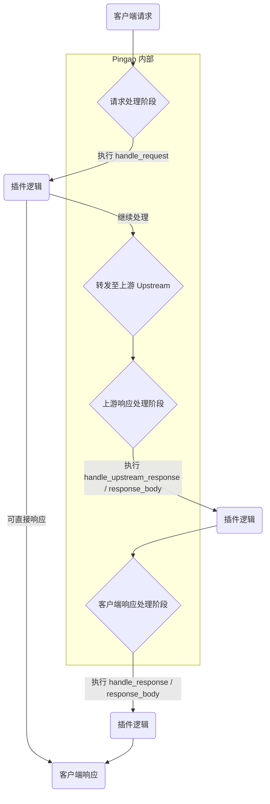
```mermaid
graph TD
    A(客户端请求) --> B{请求处理阶段};
    B -- 执行 handle_request --> B1(插件逻辑);
    B1 -- 可直接响应 --> F(客户端响应);
    B1 -- 继续处理 --> C{转发至上游 Upstream};
    C --> D{上游响应处理阶段};
    D -- 执行 handle_upstream_response / response_body --> D1(插件逻辑);
    D1 --> E{客户端响应处理阶段};
    E -- 执行 handle_response / response_body --> E1(插件逻辑);
    E1 --> F;

    subgraph "Pingap 内部"
        direction LR
        B
        C
        D
        E
    end
```

如上图所示，插件主要可以在三个大的阶段内工作，每个阶段又分为对 Header 和 Body 的处理。

## 插件的执行时点与方法

一个插件可以实现 `Plugin` trait 中的多个方法，以在生命周期的不同节点执行特定逻辑。

1. 请求处理阶段 (`handle_request`)

这是插件介入的第一个时点，在 `Pingap` 对请求进行路由并转发到上游服务之前。

- 何时调用？：在请求处理的最开始。

- 主要用途？：
  - 访问控制：如 IP 黑白名单、API 密钥认证、JWT 验证。
  - 请求修改：添加、删除或修改请求头。
  - 流量控制：请求限流。
  - 短路请求：无需访问后端，直接返回一个响应（例如，返回 Mock 数据、维护页面或重定向）。

- 关键返回值 (`RequestPluginResult`)：
  - Continue: 请求被插件处理或修改后，继续后续流程。
  - Respond: 中断当前请求，并立即向客户端返回一个由插件生成的响应。

2. 上游响应处理阶段 (`handle_upstream_response` / `handle_upstream_response_body`)

当 Pingap 收到来自后端 Upstream 的响应后，在将其缓存或进行其他处理之前，插件可以在此阶段介入。

- 何时调用？：刚收到上游响应，但在写入任何缓存之前。

- 主要用途？：
  - 原始响应探查：记录或分析来自后端的“最原始”的响应头和响应体。
  - 早期响应修改：在响应被其他模块（如缓存）使用前，修改响应头或响应体。

- 相关方法：
  - `handle_upstream_response`: 处理上游响应的 Header。
  - `handle_upstream_response_body`: 流式处理上游响应的 Body 数据块。


3. 客户端响应处理阶段 (handle_response / handle_response_body)

这是插件介入的最后一个时点，在 Pingap 准备将最终响应发送给客户端之前。

- 何时调用？：在所有内部处理（包括从缓存中获取响应）完成之后，发送给客户端之前。

- 主要用途？：
  - 最终内容修改：向 HTML 页面注入分析脚本、统一修改响应 JSON 结构、对响应体进行查找和替换。
  - 添加公共响应头：为所有响应添加如 Server-Timing、X-Trace-Id 等自定义响应头。
  - 响应压缩/解压：实现自定义的压缩逻辑。

- 相关方法与返回值：
  - `handle_response`: 处理最终响应的 Header。
  - `handle_response_body`: 流式处理最终响应的 Body。
  - 关键返回值 (ResponseBodyPluginResult)：
    - `PartialReplaced`: 替换当前收到的 Body 数据块。
    - `FullyReplaced`: 用一个全新的 Body 替换整个响应体。

## 插件 `trait` 详解

以下是开发者在创建自定义插件时需要实现的 `Plugin` trait 的定义，它清晰地展示了所有可用的生命周期钩子。

```rust
/// Core trait that defines the interface all plugins must implement.
#[async_trait]
pub trait Plugin: Sync + Send {
    /// Returns a unique key that identifies this specific plugin instance.
    fn config_key(&self) -> Cow<'_, str> {
        Cow::Borrowed("")
    }

    /// Processes an HTTP request at a specified lifecycle step.
    #[inline]
    async fn handle_request(
        &self,
        _step: PluginStep,
        _session: &mut Session,
        _ctx: &mut Ctx,
    ) -> pingora::Result<RequestPluginResult> {
        Ok(RequestPluginResult::Skipped)
    }
    
    /// Processes an upstream response header at a specified lifecycle step.
    #[inline]
    fn handle_upstream_response(
        &self,
        _session: &mut Session,
        _ctx: &mut Ctx,
        _upstream_response: &mut ResponseHeader,
    ) -> pingora::Result<ResponsePluginResult> {
        Ok(ResponsePluginResult::Unchanged)
    }

    /// Processes an upstream response body chunk at a specified lifecycle step.
    #[inline]
    fn handle_upstream_response_body(
        &self,
        _session: &mut Session,
        _ctx: &mut Ctx,
        _body: &mut Option<bytes::Bytes>,
        _end_of_stream: bool,
    ) -> pingora::Result<ResponseBodyPluginResult> {
        Ok(ResponseBodyPluginResult::Unchanged)
    }

    /// Processes the final HTTP response header before sending to the client.
    #[inline]
    async fn handle_response(
        &self,
        _session: &mut Session,
        _ctx: &mut Ctx,
        _upstream_response: &mut ResponseHeader,
    ) -> pingora::Result<ResponsePluginResult> {
        Ok(ResponsePluginResult::Unchanged)
    }

    /// Processes the final HTTP response body chunk before sending to the client.
    #[inline]
    fn handle_response_body(
        &self,
        _session: &mut Session,
        _ctx: &mut Ctx,
        _body: &mut Option<bytes::Bytes>,
        _end_of_stream: bool,
    ) -> pingora::TResult<ResponseBodyPluginResult> {
        Ok(ResponseBodyPluginResult::Unchanged)
    }
}
```


## Stats 性能统计插件

Stats插件用于暴露应用的性能指标数据,方便第三方系统采集监控。可以通过以下两种方式使用:

1. 使用内置的 `pingap:stats` 插件
2. 自定义配置新的 Stats 插件

### 配置示例

```toml
[plugins.stats]
category = "stats"
path = "/stats"  # 访问路径
remark = "性能指标采集"
```

### 配置参数

- `path`: 指标数据访问路径,如配置为 `/stats` 则可通过该路径获取性能指标
- `step`: 插件执行时机,可选 `request` 或 `proxy_upstream` 

### 使用方式

配置完成后,可以通过访问对应 location 下的 `/stats` 路径获取性能指标数据。

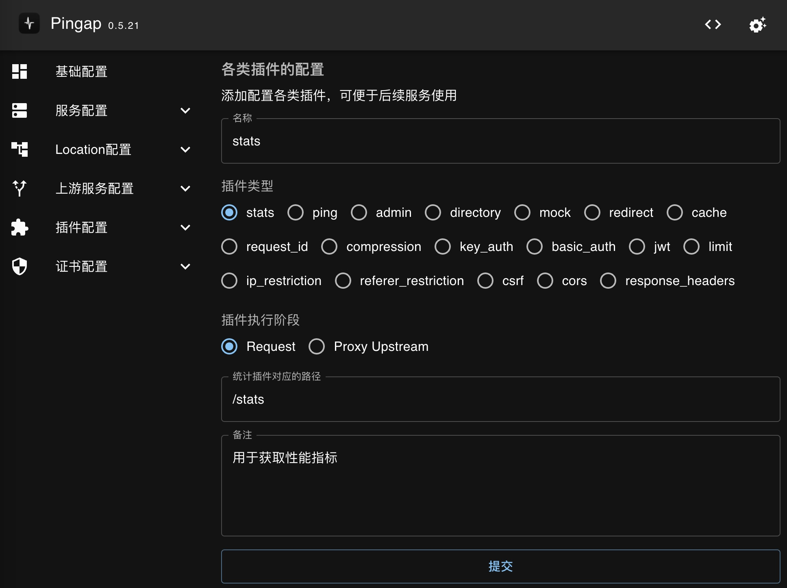

## Ping

Ping插件提供了一个简单的健康检查端点,用于监控服务是否正常运行。当配置了反向代理时,也可以作为 pingap 的健康检查机制，该插件固定执行在`request`阶段。

```toml
[plugins.pingpong]
category = "ping" 
path = "/ping"  # 健康检查路径
```

### 配置参数

- `path`: 健康检查的访问路径,访问该路径时会返回 "pong" 响应
- `step`: 插件执行时机,仅支持 `request` 阶段

### 使用方式

配置完成后,访问对应的 path 路径(如 `/ping`)即可获得 "pong" 响应,用于验证服务是否存活。

## Admin

Admin 插件用于为现有 location 添加管理后台功能。配置示例：

```toml
[plugins.admin]
authorizations = ["YWRtaW46MTIzMTIz"] # base64(admin:123123)
category = "admin"
ip_fail_limit = 10
max_age = "7d" 
path = "/pingap"
remark = "管理后台"
```

### 配置参数

- `authorizations`: Basic 认证的密钥列表，使用 base64 编码的 `用户名:密码` 格式
- `ip_fail_limit`: 单个 IP 允许的最大认证失败次数
- `path`: 管理后台访问路径
- `max_age`: 登录会话有效期，默认为 2 天
- `step`: 插件执行时机，可选 `request` 或 `proxy_upstream`

### 使用方式

1. 将插件配置关联到指定 location
2. 访问该 location 下的配置路径(如 `/pingap/`)即可进入管理后台
3. 使用配置的账号密码登录(示例中为 `admin/123123`)

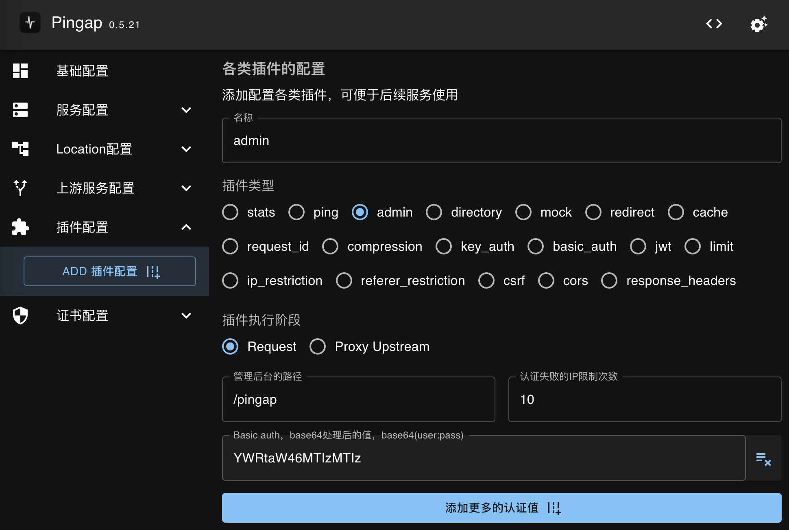

## Directory

Directory 插件提供静态文件服务功能，支持文件浏览和下载。

### 配置示例

```toml
[plugins.downloadsServe]
category = "directory"
path = "~/Downloads"
chunk_size = "4kb"
max_age = "1h"
private = true
index = "index.html"
charset = "utf-8"
autoindex = true
download = true
headers = [
    "X-Server:pingap",
]
```

### 配置参数

- `path`: 静态文件目录路径
- `chunk_size`: HTTP 分块传输大小，默认 `8kb`
- `max_age`: HTTP 缓存时间
  - 默认不设置缓存
  - 对 `text/html` 类型始终禁用缓存
  - 如 `1h` 表示缓存 1 小时
- `private`: 是否将缓存设为 `private`（默认为 `public`）
- `index`: 默认索引文件名，默认为 `index.html`
- `charset`: 指定字符集编码，默认不设置
- `autoindex`: 是否启用目录浏览
  - 启用后 `index` 参数将失效
- `download`: 是否启用文件下载
  - 启用后将设置 `Content-Disposition` 响应头
- `headers`: 自定义 HTTP 响应头列表
- `step`: 插件执行时机，可选 `request` 或 `proxy_upstream`，若设置为`proxy_upstream`并添加相应的缓存插件，可大幅度提供性能

### 使用方式

在界面中配置静态文件目录路径，根据需要调整其他参数：

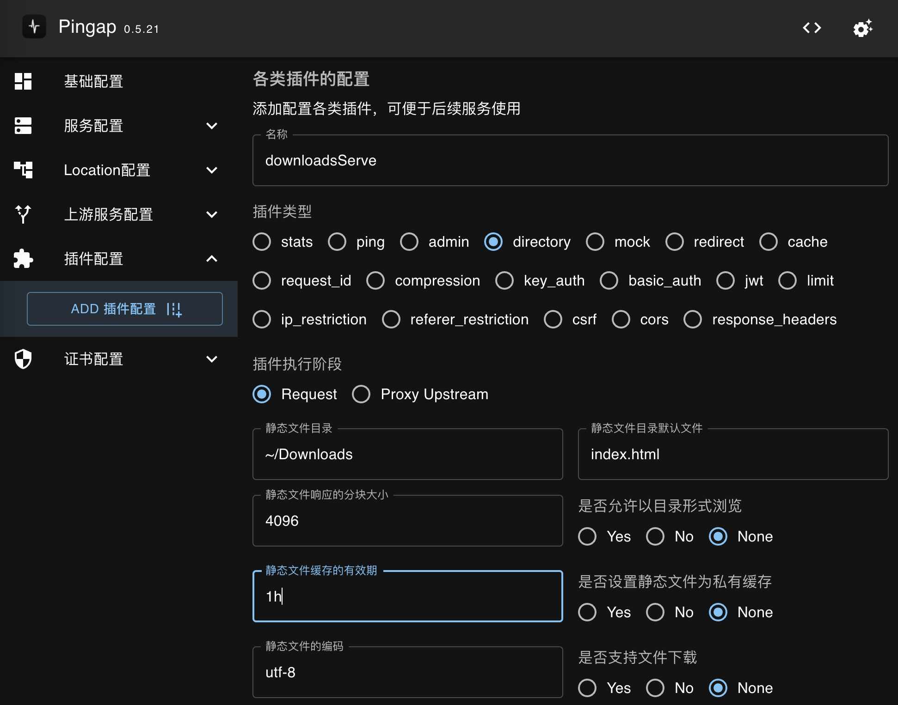

## Mock

Mock 插件用于模拟 HTTP 响应，可用于测试或临时服务降级。支持自定义响应内容、状态码和响应头，访插件固定执行在`request`阶段。

### 配置示例

```toml
[plugins.errorMock]
category = "mock"
data = '{"error": "error message"}'
delay = "1s"
headers = [
    "X-Error:CustomRrror",
    "Content-Type:application/json",
]
path = "/"
status = 500
```

### 配置参数

- `data`: 模拟的响应数据
  - 对于不同类型的数据，需在 `headers` 中指定对应的 `Content-Type`
- `headers`: 自定义响应头列表
- `path`: 需要模拟响应的请求路径
  - 不配置则匹配所有路径
- `status`: HTTP 响应状态码
- `delay`: 响应延迟时间

### 使用方式

在界面中配置响应数据和相关参数，注意根据响应数据类型设置正确的 Content-Type：

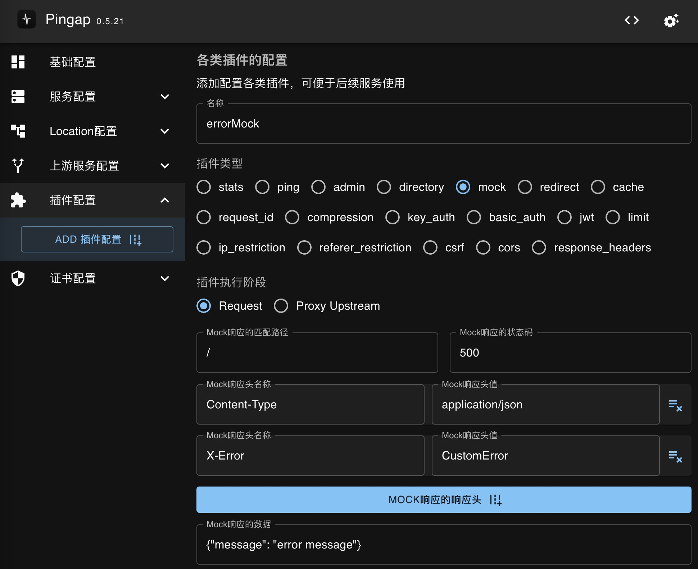

## Redirect

Redirect 插件用于 HTTP 请求重定向，支持添加 URL 前缀或将 HTTP 请求重定向至 HTTPS，访插件固定执行在`request`阶段。

### 配置示例

```toml
[plugins.http2https]
category = "redirect"
http_to_https = true
prefix = "/api"
```

### 配置参数

- `http_to_https`: 是否将 HTTP 请求重定向至 HTTPS
- `prefix`: 重定向时要添加的 URL 前缀
- `step`: 插件执行时机，仅支持 `request`

### 使用方式

在界面中配置重定向参数：
- 启用 HTTPS 重定向：勾选 `http_to_https`
- 添加 URL 前缀：在 `prefix` 字段中填写（可选）

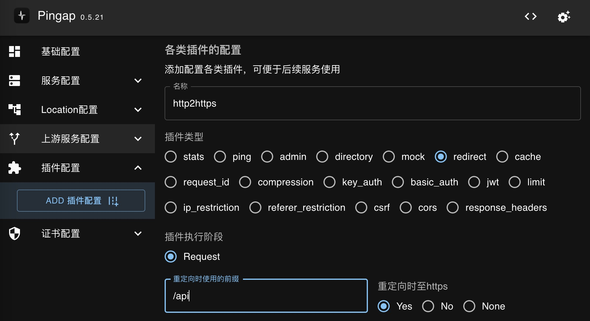

## Cache

缓存中间件，用于缓存 HTTP 请求。由于缓存暂时仅支持全局初始化，为避免相同 URL 的冲突，建议每个 location 使用不同的插件设置不同的 namespace，该插件固定在`request`阶段执行。

### 配置示例

```toml
[plugins.chartsCache]
category = "cache"
eviction = true
headers = ["Accept-Encoding"]
lock = "3s"
max_file_size = "100kb"
max_ttl = "1h"
namespace = "charts"
predictor = true
purge_ip_list = [
    "127.0.0.1",
    "192.168.1.1/24"
]
check_cache_control = false
```

### 配置参数

- `lock`: 缓存不存在请求转发至upstream等待时，相同请求的等待时长，默认为 1 秒
  - 用于避免缓存击穿
- `max_file_size`: 单个缓存文件的最大长度，默认为 1MB
  - 建议设置合理的值，避免过大的响应占用过多内存
- `namespace`: 缓存命名空间
  - 缓存键基于 namespace + path + querystring 生成
  - 多域名场景建议使用不同的命名空间
  - 文件缓存时对应单独的文件目录
- `max_ttl`: 缓存的最长有效期
  - 当上游响应的 `Cache-Control` 的 `max-age` 较长时，建议设置较短的 `s-maxage`
  - 当上游未设置 `s-maxage` 时，可通过此配置限制缓存时间
- `eviction`: 是否启用缓存清除机制
  - 当缓存超限时触发清除
  - 文件缓存会自动清除长期未访问的缓存，可不设置
- `predictor`: 是否记录无法缓存的请求
  - 避免重复判断请求是否可缓存
- `headers`: 作为缓存键一部分的请求头列表
  - 当响应的缓存依赖特定请求头时配置
  - 例如：上游支持不同压缩算法时，需包含 `Accept-Encoding`
- `purge_ip_list`: 允许执行 purge 请求的 IP 列表，默认为空
- `skip`: 跳过缓存的正则表达式，请求url匹配则跳过缓存插件，默认为空
  - 用于快速跳过某些请求的缓存判断
- `check_cache_control`: 校验cache-control响应头，若无均认为不可缓存
### 界面配置

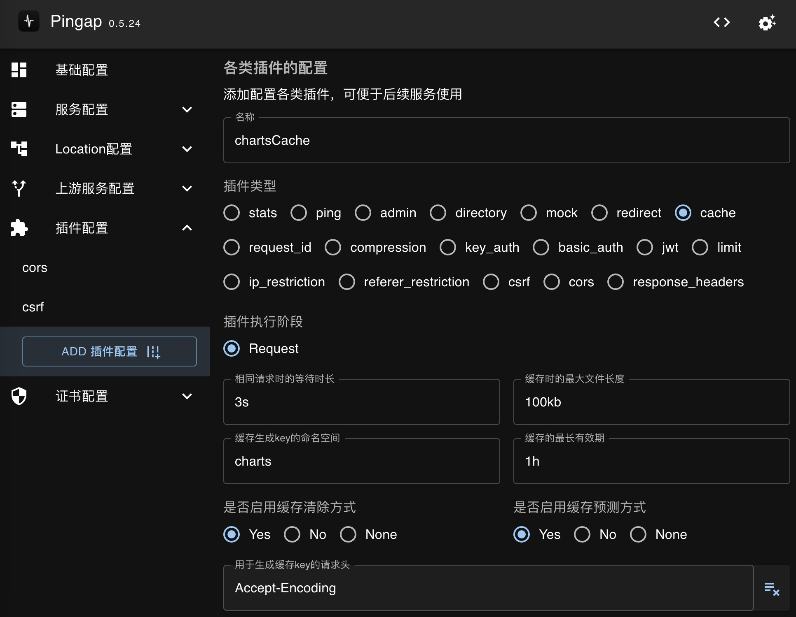

## RequestId

为每个请求添加唯一标识符。默认添加到 `X-Request-Id` 请求头中(可自定义请求头名称)。如果请求中已存在该请求头，则保留原值不做修改。

### 配置示例

```toml
[plugins.customReqId]
algorithm = "nanoid"  # 可选: uuid 或 nanoid
category = "request_id"
size = 8              # nanoid 长度，仅在 algorithm=nanoid 时有效
header = "X-Request-Id"  # 可选：自定义请求头名称
step = "request"      # 可选: request 或 proxy_upstream
```

### 配置参数

- `algorithm`: 生成请求 ID 的算法
  - `uuid`: 使用 UUID v4 格式
  - `nanoid`: 使用 NanoID 格式(更短、URL 安全)
- `size`: NanoID 长度，仅当 algorithm=nanoid 时有效
- `header`: 自定义请求头名称，默认为 `X-Request-Id`
- `step`: 插件执行时机，可选 `request` 或 `proxy_upstream`

### 使用场景

- 请求追踪：方便在分布式系统中追踪请求链路
- 日志关联：通过请求 ID 关联不同服务的日志
- 问题排查：使用请求 ID 快速定位问题

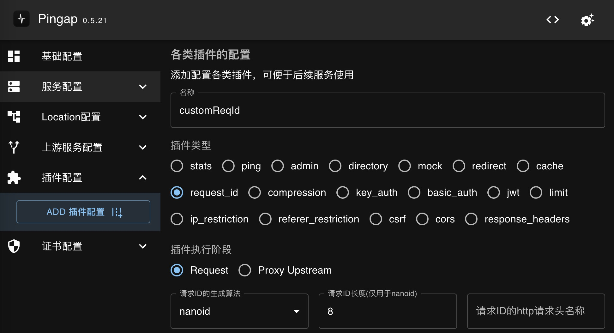

## Compression

HTTP 响应压缩插件，用于处理上游返回数据的压缩。支持 gzip、brotli(br) 和 zstd 三种压缩算法。

### 工作原理

由于 Pingora 默认的压缩算法匹配顺序为 `gzip --> br --> zstd`，而现代浏览器对这些算法的支持情况为：
- gzip: 基本全部支持
- br(brotli): 大部分支持
- zstd: 部分支持

为了优化压缩效果，pingap会根据配置以及浏览器支持的压缩算法，按`zstd --> br --> gzip`的规则设置，只设置一个压缩算法。

### 配置示例

```toml
[plugins.commonCompression]
category = "compression"
br_level = 6      # brotli 压缩级别 (0-11)
gzip_level = 6    # gzip 压缩级别 (0-9)
zstd_level = 5    # zstd 压缩级别 (0-22)
decompression = true
```

### 配置参数

- `br_level`: brotli 压缩级别，范围 0-11，0 表示禁用
- `gzip_level`: gzip 压缩级别，范围 0-9，0 表示禁用
- `zstd_level`: zstd 压缩级别，范围 0-22，0 表示禁用
- `decompression`: 是否解压上游返回的压缩数据

### 内置配置

可以使用内置的 `pingap:compression` 插件，其默认配置为：
- gzip_level = 6
- br_level = 6
- zstd_level = 3

### 执行阶段

插件固定在 `early_request` 阶段执行，无需手动指定。

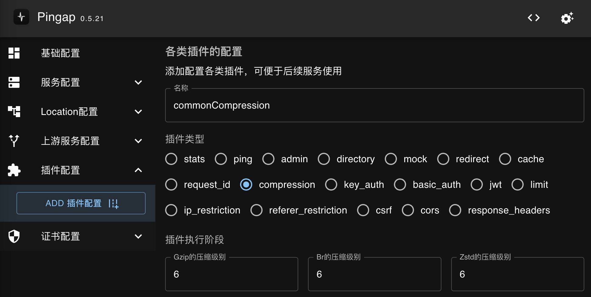

## AcceptEncoding

用于管理和优化 HTTP 请求的 Accept-Encoding 头，允许自定义支持的压缩算法及其优先顺序，顺序建议为zdt > br > gzip。

### 配置示例

```toml
[plugins.acceptEncoding]
category = "accept_encoding"
encodings = "zstd, br, gzip"    # 支持的编码及优先顺序
only_one_encoding = true        # 是否仅使用单一编码
```

### 配置参数

- `encodings`: 指定支持的压缩算法及其优先顺序
  - 多个算法用逗号分隔
  - 顺序从左到右表示优先级从高到低
  - 支持的算法: zstd、br、gzip
- `only_one_encoding`: 是否仅保留一种编码方式
  - `true`: 仅使用优先级最高的支持的编码
  - `false`: 保留所有支持的编码，按优先级排序

### 执行阶段

插件固定在 `early_request` 阶段执行，无需手动指定。

## KeyAuth

提供简单的 API 密钥认证机制，支持从请求参数(query)或请求头(header)中获取认证信息。可配置多个有效密钥，方便多系统接入，访插件固定执行在`request`阶段。

### 配置示例

#### 从请求参数获取认证信息

```toml
[plugins.queryAuth]
category = "key_auth"
query = "app"           # 从 URL 参数 app 中获取密钥
keys = [               # 允许的密钥列表
    "KOXQaw",
    "GKvXY2",
]
delay = "1s"
hide_credentials = true
```

#### 从请求头获取认证信息

```toml
[plugins.headerAuth]
category = "key_auth"
header = "X-App"        # 从请求头 X-App 中获取密钥
keys = [               # 允许的密钥列表
    "KOXQaw",
    "GKvXY2",
]
delay = "1s"
hide_credentials = true
```

### 配置参数

- `query`: 从请求参数中获取密钥的参数名
- `header`: 从请求头中获取密钥的头部名称
  - `query` 和 `header` 二选一，同时配置时优先使用 `query`
- `keys`: 允许的密钥列表
- `delay`: 认证失败时的响应延迟时间
- `hide_credentials`: 是否在转发请求时移除认证信息

### 界面配置

配置密钥获取方式（请求参数或请求头）及对应的有效密钥列表：

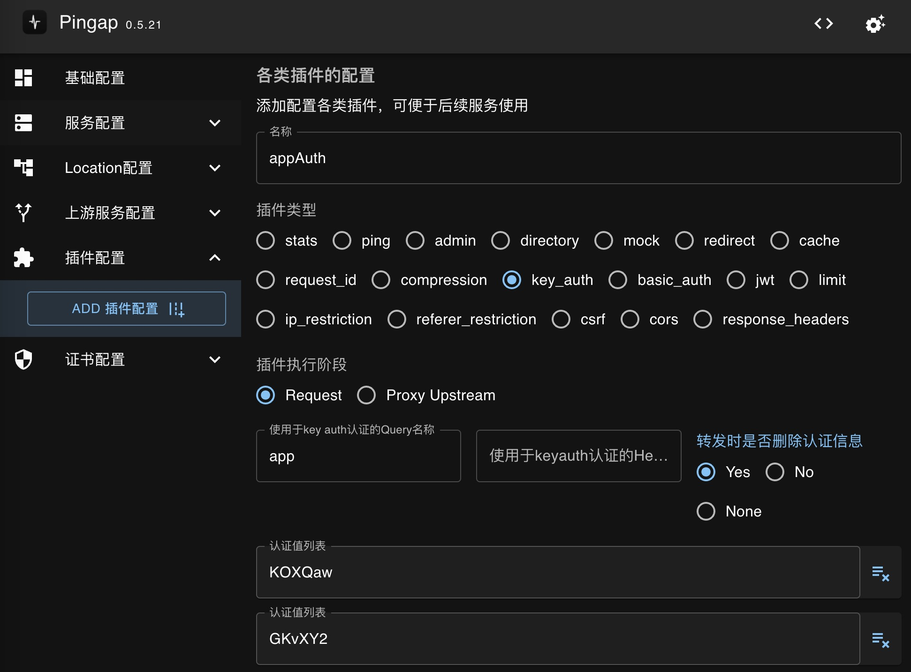

## BasicAuth

提供 HTTP Basic Authentication 认证功能。支持配置多组用户名/密码对,需以 base64 编码格式配置，该插件固定在`request`阶段执行。

### 配置示例

```toml
[plugins.testBasicAuth]
authorizations = [
    "YWRtaW46dGVzdA==",    # admin:test
    "YWRtaW46MTIzMTIz",    # admin:123123
]
category = "basic_auth"
delay = "1s"
hide_credentials = true
```

### 配置参数

- `authorizations`: 认证凭据列表
  - 格式为 `base64(username:password)`
  - 可配置多组凭据
- `delay`: 认证失败时的响应延迟时间
- `hide_credentials`: 是否在转发请求时移除认证信息

### 使用说明

1. 将用户名和密码按 `username:password` 格式拼接
2. 对拼接结果进行 base64 编码
3. 将编码后的字符串添加到 `authorizations` 列表中

例如:
- `admin:test` -> `YWRtaW46dGVzdA==`
- `admin:123123` -> `YWRtaW46MTIzMTIz`

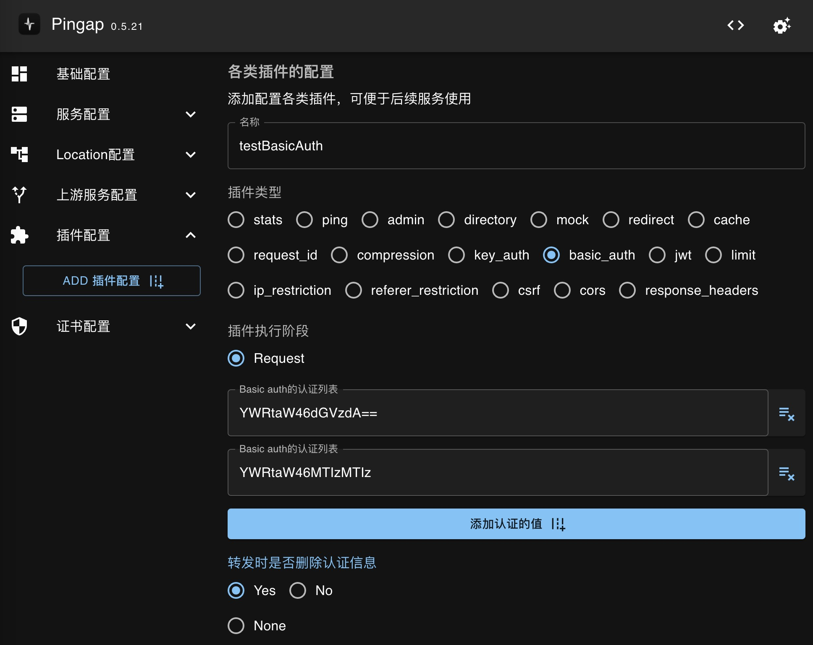

## JWT

提供 JWT (JSON Web Token) 认证功能，该插件固定执行在`request`阶段。包含两个主要功能:
1. 在指定路径生成 JWT token
2. 验证请求中携带的 JWT token 是否有效

### 配置示例

```toml
[plugins.jwtAuth]
algorithm = "HS256"
auth_path = "/jwt-sign"
category = "jwt"
delay = "1s"
header = "X-Jwt"
secret = "123123"
```

### 配置参数

- `auth_path`: 用于生成 JWT token 的路径
  - 访问该路径时,会将响应数据作为 payload 生成 token
- `algorithm`: JWT 签名算法,目前支持 HS256
- `secret`: 签名密钥
- `header`: 从请求头获取 token 的字段名
- `cookie`: 从 cookie 获取 token 的字段名
- `query`: 从 URL 参数获取 token 的字段名
  - token 获取优先级: header > cookie > query
  - 三个参数至少配置其中一个
- `delay`: 认证失败时的响应延迟时间

### 工作流程

1. 生成 token:
   - 访问 `auth_path` 配置的路径
   - 将响应数据作为 payload 签名生成 token
   - 返回生成的 token

2. 验证 token:
   - 访问其他路径时,按优先级获取 token
   - 验证 token 的签名和有效性
   - 验证通过则继续处理,否则返回认证错误

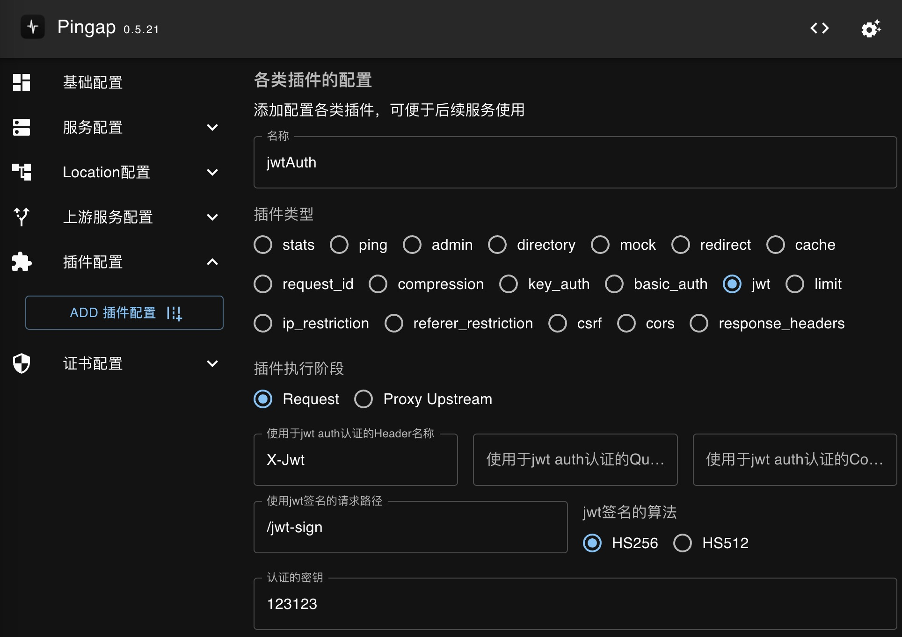

## CombinedAuth

提供基于应用 ID、密钥和时间戳的组合式认证机制。支持为每个应用配置独立的认证参数和 IP 白名单，该插件固定在`request`阶段执行。

### 配置示例

```toml
[plugins.appAuth]
category = "combined_auth"

[[plugins.appAuth.authorizations]]
app_id = "pingap"
deviation = 10
ip_list = [
    "192.168.1.1/24",
    "127.0.0.1",
]
secret = "123123"
```

### 配置参数

- `app_id`: 应用标识符
- `secret`: 用于生成摘要的密钥
- `deviation`: 允许的时间戳偏差(单位:秒)
  - 用于处理客户端与服务器时间不完全同步的情况
- `ip_list`: 允许访问的 IP 白名单
  - 支持单个 IP 和 CIDR 格式的网段
- `step`: 插件执行时机,仅支持 `request`

### 认证流程

1. 客户端构造请求参数:
   - `app_id`: 配置的应用标识符
   - `ts`: 当前时间戳
   - `digest`: 通过 SHA256 算法计算得出的摘要值
     - 计算公式: `SHA256(secret:timestamp)`

2. 请求示例:
```
GET /api?app_id=pingap&ts=1727582506&digest=85c623c389177a69860adfd572212507ef98c197ba5105677919e0663eeae091
```

3. 服务端验证:
   - 检查请求 IP 是否在白名单中
   - 验证时间戳是否在允许的偏差范围内
   - 使用相同算法计算摘要并比对

## Limit

提供基于多种条件的访问限制功能。支持并发数(inflight)和访问频率(rate)两种限制类型，可以根据 Cookie、请求头、URL 参数或 IP 地址进行限制。

### 配置参数

- `type`: 限制类型
  - `inflight`: 并发访问数限制
  - `rate`: 访问频率限制
- `tag`: 限制条件来源
  - `cookie`: 从 Cookie 获取
  - `header`: 从请求头获取
  - `query`: 从 URL 参数获取
  - `ip`: 基于访问者 IP
- `key`: 获取限制值的字段名称
  - 使用 `ip` 类型时无需指定
- `max`: 最大允许值
- `interval`: 统计时间间隔(仅用于 rate 类型)
- `step`: 插件执行时机，可选 `request` 或 `proxy_upstream`。若设置为`proxy_upstream`再增加对应的缓存插件，则可只针对转发至upstream的请求才会增加次数

### 配置示例

1. 基于 Cookie 的并发限制:
```toml
[plugins.cookieBigTreeLimit]
category = "limit"
type = "inflight"
tag = "cookie"
key = "bigtree"
max = 10
step = "request"
```

2. 基于请求头的并发限制:
```toml
[plugins.headerAppLimit]
category = "limit"
type = "inflight"
tag = "header"
key = "X-App"
max = 10
```

3. 基于 URL 参数的频率限制:
```toml
[plugins.queryAppLimit]
category = "limit"
type = "rate"
tag = "query"
key = "app"
max = 10
interval = "1s"
```

4. 基于 IP 的频率限制:
```toml
[plugins.ipLimit]
category = "limit"
type = "rate"
tag = "ip"
max = 10
interval = "1m"
```

### 补充说明

- IP 获取优先级: X-Forwarded-For > X-Real-Ip > Remote Addr
- 当限制条件值为空时不进行限制
- 频率限制需要配置 `interval` 参数
- 并发限制不需要配置 `interval` 参数
- rate限制现仅简单的分区间限制，每次仅计算上一区间的访问频率是否超限，后续调整为两个区间按权重计算

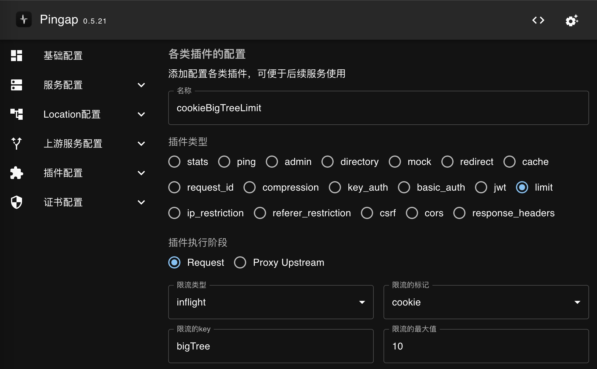

## IpRestriction

提供基于 IP 地址的访问控制功能。支持设置允许(allow)或禁止(deny)两种模式，可配置单个 IP 地址或 CIDR 格式的网段，该插件固定执行在`request`阶段。

### 配置示例

```toml
[plugins.ipDeny]
category = "ip_restriction"
ip_list = [
    "192.168.1.1",      # 单个 IP 地址
    "1.1.1.0/24",       # CIDR 格式网段
]
message = "禁止该IP访问"
type = "deny"
```

### 配置参数

- `type`: 访问控制模式
  - `allow`: 仅允许列表中的 IP 访问
  - `deny`: 禁止列表中的 IP 访问
- `ip_list`: IP 地址列表
  - 支持单个 IP 地址
  - 支持 CIDR 格式的网段
- `message`: 访问被拒绝时的提示信息

### 使用说明

1. 选择访问控制模式(允许/禁止)
2. 添加需要控制的 IP 地址或网段
3. 配置被拒绝访问时的提示信息

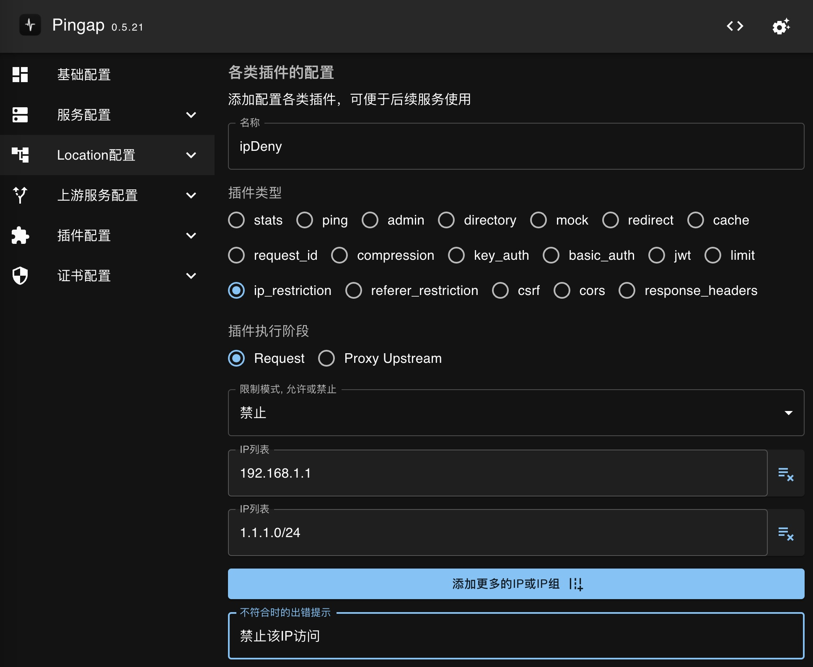

## UaRestriction

提供基于 User-Agent 的访问控制功能。支持设置允许(allow)或禁止(deny)两种模式，可使用正则表达式进行匹配。

### 配置示例

```toml
[plugins.userAgentDeny]
category = "ua_restriction"
ua_list = [
    "go-http-client/1.1",                  # 精确匹配
    "(Twitterspider)/(\\d+)\\.(\\d+)"     # 正则匹配
]
message = "禁止访问"
step = "request"
type = "deny"
```

### 配置参数

- `type`: 访问控制模式
  - `allow`: 仅允许列表中匹配的 User-Agent
  - `deny`: 禁止列表中匹配的 User-Agent
- `ua_list`: User-Agent 匹配规则列表
  - 支持精确匹配
  - 支持正则表达式匹配
- `message`: 访问被拒绝时的提示信息
- `step`: 插件执行时机，仅支持 `request`

### 使用说明

1. 选择访问控制模式(允许/禁止)
2. 添加 User-Agent 匹配规则
   - 直接填写完整的 User-Agent 字符串进行精确匹配
   - 使用正则表达式匹配特定模式的 User-Agent
3. 配置被拒绝访问时的提示信息

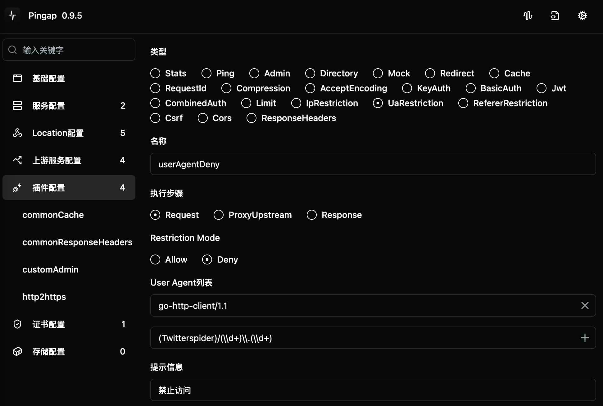

## RefererRestriction

提供基于 HTTP Referer 的访问控制功能。支持设置允许(allow)或禁止(deny)两种模式，可使用通配符(*)进行域名匹配，该插件固定执行在`request`阶段。

### 配置示例

```toml
[plugins.referer]
category = "referer_restriction"
referer_list = [
    "*.github.com",     # 匹配所有 github.com 的子域名
    "example.com"       # 精确匹配
]
message = "禁止访问"
type = "allow"
```

### 配置参数

- `type`: 访问控制模式
  - `allow`: 仅允许列表中匹配的 Referer
  - `deny`: 禁止列表中匹配的 Referer
- `referer_list`: Referer 匹配规则列表
  - 支持精确匹配
  - 支持使用 * 作为通配符匹配子域名
- `message`: 访问被拒绝时的提示信息

### 使用说明

1. 选择访问控制模式(允许/禁止)
2. 添加 Referer 匹配规则
   - 直接填写域名进行精确匹配
   - 使用 `*.domain.com` 格式匹配所有子域名
3. 配置被拒绝访问时的提示信息

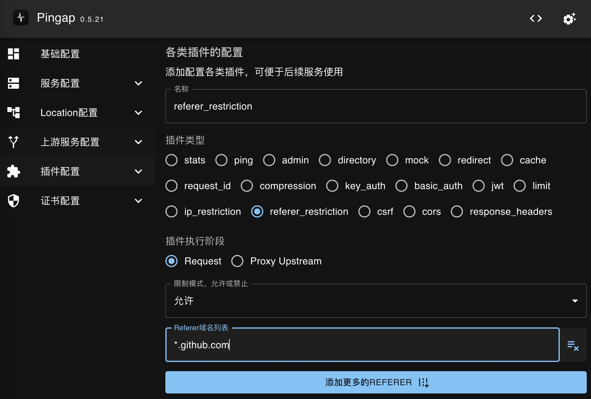

## CSRF

提供跨站请求伪造(Cross-Site Request Forgery)防护功能。通过比对请求中的 cookie 和请求头中的 token 值来验证请求的合法性，该插件固定在`request`阶段执行。

### 配置示例

```toml
[plugins.csrf]
category = "csrf"
key = "WjrXUG47wu"
name = "x-csrf-token"
token_path = "/csrf-token"
ttl = "1h"
```

### 配置参数

- `key`: 用于生成 token 的密钥
- `name`: CSRF token 的名称
  - 用作 cookie 名和请求头名
- `token_path`: 获取 token 的路径
  - 访问该路径时会生成新的 token
  - 同时设置同名的 cookie，启用 SameSite 保护
- `ttl`: token 的有效期
- `step`: 插件执行时机，仅支持 `request`

### 工作流程

1. 获取 token:
   - 客户端访问 `token_path` 配置的路径
   - 服务器生成 token 并设置到 cookie 中
   - cookie 设置为 SameSite 模式以增强安全性

2. 请求验证:
   - 客户端在请求头中携带 token
   - 服务器比对请求头和 cookie 中的 token
   - 若不一致则拒绝请求

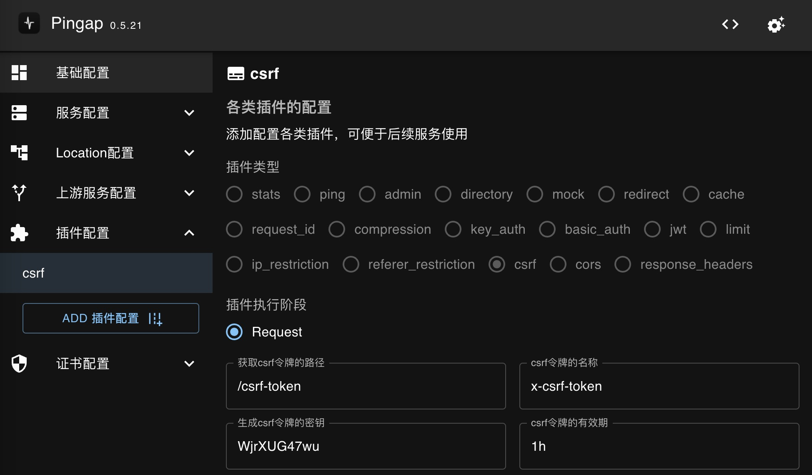

## CORS

提供跨域资源共享(Cross-Origin Resource Sharing)配置功能，用于控制浏览器跨域访问策略，该插件固定在`request`阶段执行。

### 配置示例

```toml
[plugins.cors]
allow_credentials = true
allow_headers = "Content-Type, X-User-Id"
allow_methods = "GET, POST, OPTIONS"
allow_origin = "$http_origin"
category = "cors"
expose_headers = "Content-Type, X-Device"
max_age = "1h"
path = "^/api"
```

### 配置参数

- `allow_origin`: 允许跨域请求的源
  - 可以指定具体域名，如 `https://example.com`
  - 设置为 `$http_origin` 表示允许请求来源，不建议在生产环境使用
  - 建议明确指定允许的域名列表，不建议直接使用`*`
- `allow_credentials`: 是否允许携带认证信息
  - 包括 Cookie、HTTP 认证及客户端 SSL 证书
- `allow_methods`: 允许的 HTTP 请求方法
  - 多个方法用逗号分隔，如 `GET, POST, OPTIONS`
- `allow_headers`: 允许的自定义请求头，若不设置则默认所有
  - 多个请求头用逗号分隔
- `expose_headers`: 允许浏览器访问的响应头
  - 默认情况下浏览器只能访问基本响应头
  - 通过此参数可以暴露自定义响应头
- `max_age`: 预检请求结果的缓存时间
- `path`: CORS 配置生效的路径范围
  - 支持正则表达式匹配

### 安全建议

1. 避免使用 `$http_origin`，应明确指定允许的域名
2. 仅配置必要的请求方法和请求头
3. 谨慎配置 `allow_credentials`，可能带来安全风险
4. 合理设置 `max_age` 以平衡性能和安全性

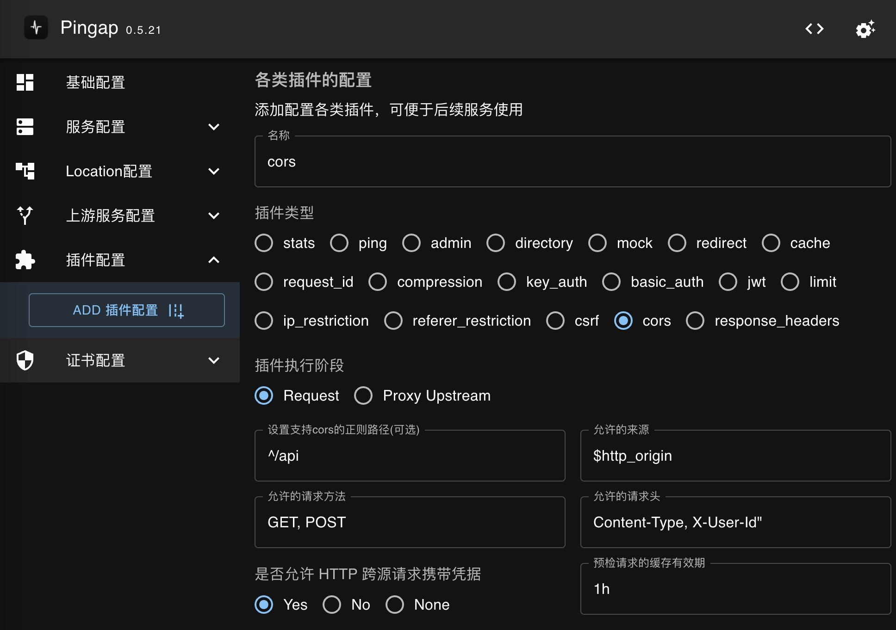

## ResponseHeaders

提供 HTTP 响应头的管理功能，支持添加、设置和删除响应头，该插件固定执行在`response`阶段。支持使用变量引用:
- `$hostname`: 引用服务器主机名
- `$变量名`: 引用环境变量值

### 配置示例

```toml
[plugins.commonResponseHeaders]
add_headers = ["X-Server:pingap"]
category = "response_headers"
remove_headers = ["X-User"]
set_headers = ["X-Response-Id:123"]
rename_headers = ["x-old-header:x-new-header"]
set_headers_not_exists = ["x-server-ip:192.168.1.1"]
```

### 配置参数

- `add_headers`: 需要添加的响应头
  - 不会覆盖已存在的同名响应头
- `set_headers`: 需要设置的响应头
  - 会覆盖已存在的同名响应头
- `remove_headers`: 需要删除的响应头
  - 删除指定名称的响应头
- `rename_headers`: 需要重命名的响应头
- `set_headers_not_exists`: 如果响应头不存在才设置

### 执行顺序

操作按以下顺序执行:
1. `add_headers`: 添加新的响应头
2. `remove_headers`: 删除指定的响应头
3. `set_headers`: 设置(覆盖)响应头
4. `rename_headers`: 重命名响应头
5. `set_headers_not_exists`: 设置不存在的响应头

### 使用说明

1. 根据需要配置要添加、设置或删除的响应头
2. 每个配置项都是可选的，不需要的可以不设置
3. 响应头的值可以使用变量:
   - `$hostname` 获取服务器主机名
   - `$VARIABLE_NAME` 获取环境变量值

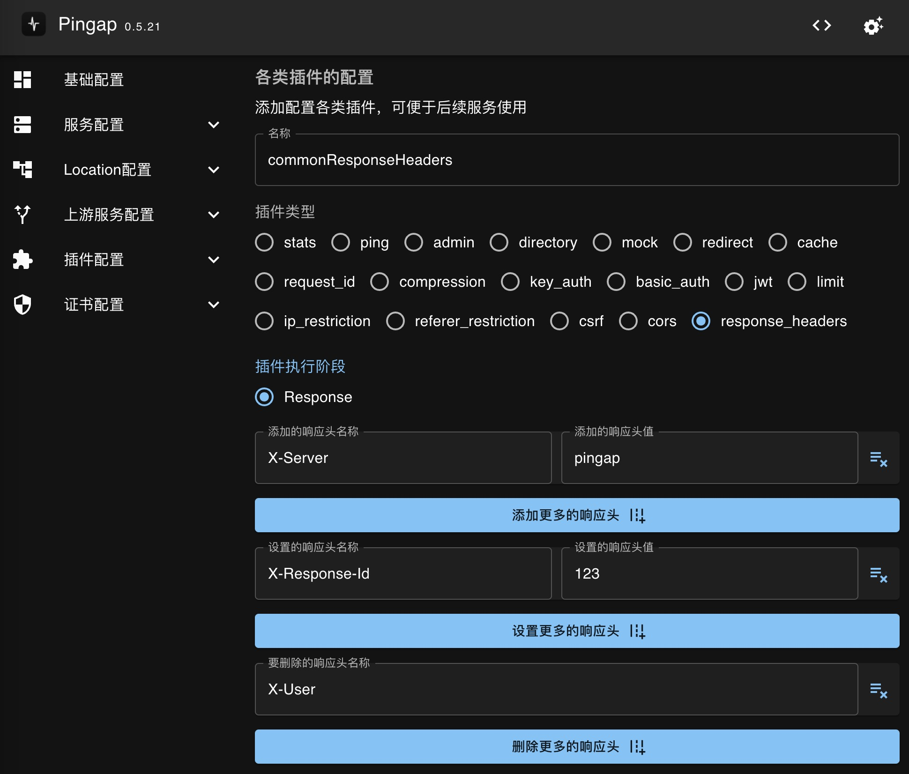


## SubFilter

支持常规或正则形式的文本匹配，用于替换http的响应内容，该插件固定执行在`response`阶段。


```toml
[plugins.textReplace]
category = "sub_filter"
filters = [
    "subs_filter 'mobile' 'Mobile' ig",
    "sub_filter 'online' 'ONLINE'",
]
path = "^/api/"
```

### 配置参数

- `path`: 匹配需要对响应改造的路径，按正则匹配
- `filters`: 配置内容替换规则，可以配置多条规则，支持两种类型
  - `subs_filter`: 正则匹配替换模式
  - `sub_filter`: 普通文本替换模式